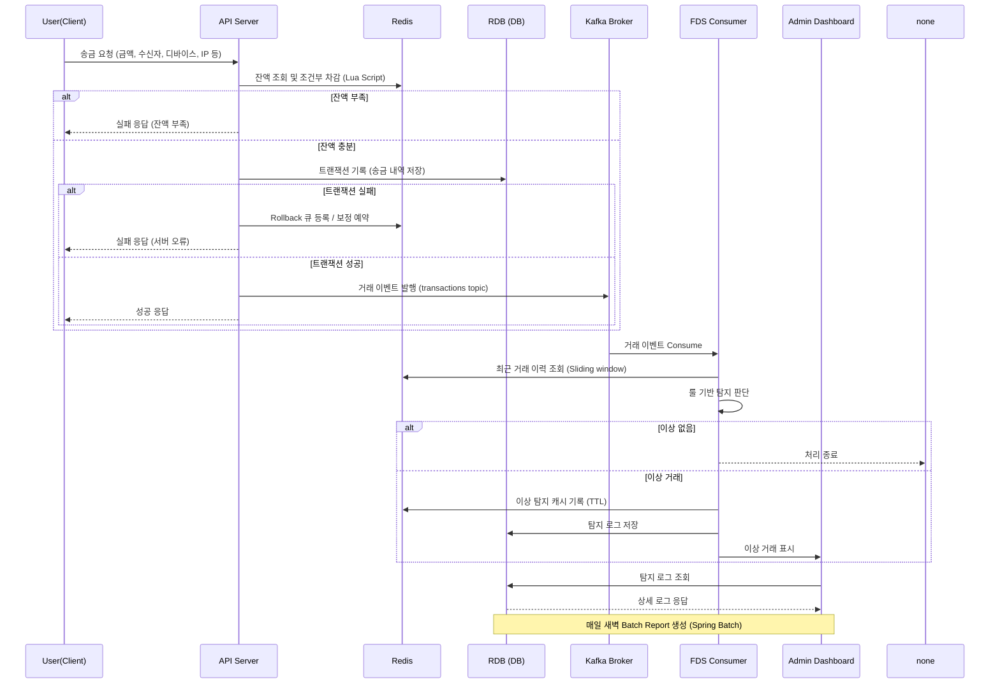

# 이상 거래 실시간 탐지 시스템 (FDS)

## 프로젝트 개요
사용자 거래에서 이상 징후를 실시간으로 감지하고, 관리자에게 알림과 리포트를 제공하는 FDS 시스템

## 목표

- Kafka 기반 이벤트 스트리밍 구조 설계
- Redis 기반 실시간 탐지 구조 구현
- 이상 거래 룰 기반 탐지 및 관리자 대시보드 구축
- 추후 AI 기반 탐지 확장이 가능한 형태로 설계
- 실시간성과 확장성을 고려한 아키텍처 실습

## 해결하고자 하는 문제

| 사례 | 설명 |
|------|------|
| 토스 | 3초 간격 5회 송금 시도 → 자동 차단 |
| 신한은행 | 새벽 2시 해외 결제 → 탐지 후 보류 |
| 카카오페이 | 낯선 기기에서 고액 결제 → 알림 후 차단 |

---

## 시스템 구성도 (시퀀스 다이어그램)

## 기술 스택
- Java 17 / Spring Boot / Spring Security / JPA (일부 영역)
- Kafka / Redis / MySQL
- Spring Batch (리포트)
- REST API + Swagger
- Docker, GitHub Actions, (Naver Cloud, AWS 등)
- React + Tailwind (Admin Dashboard)

## 기능 요약
| 범주       | 설명                          | 기술                          |
| -------- | --------------------------- | --------------------------- |
| 송금 API   | 사용자 인증 후 금액 검증 및 거래 생성      | REST API, JWT               |
| 잔액 확인    | Redis에서 Lua 기반 조건부 차감 처리    | Redis + Lua                 |
| 이벤트 발행   | Kafka에 거래 이벤트 비동기 전송        | Kafka Producer              |
| 실시간 탐지   | 룰 기반 탐지 로직 적용               | Kafka Consumer + Redis ZSET |
| 이상 거래 로그 | DB 저장 + Redis 캐시 + Slack 알림 | Redis + RDB + Webhook       |
| 관리자 대시보드 | 이상 거래 필터링/조회                | React + REST API            |
| 리포트 자동화  | 일간 통계 자동 생성 및 저장            | Spring Batch                |

### Kfaka 사용 이유
| 항목       | Kafka 기반 구조    | REST + DB       |
| -------- | -------------- | --------------- |
| 실시간성     | ms 단위 탐지 가능    | 배치 or 후처리       |
| 확장성      | 컨슈머 수평 확장      | DB 트랜잭션 병목      |
| 장애 복구    | offset 기반 재처리  | 수동 리커버리         |
| 후속 처리 분기 | 탐지, 알림 등 분기 가능 | 단일 처리 흐름        |
| AI 확장성   | 이벤트 replay 가능  | polling/dump 필요 |

### 잔액 동기화 구조 (Redis ↔ RDB)
- Redis에서 조건부 차감
- 성공 시 RDB 트랜잭션 처리
- 트랜잭션 실패 시 rollback_queue에 복구 항목 저장 
- 주기적으로 rollback queue 스캔 → Redis 복구 시도 
- Spring Batch로 Redis ↔ DB 정합성 비교 + 보정

### 트랜잭션 처리 흐름
클라이언트 → 송금 요청 (금액, 디바이스, IP 포함)
API 서버: 
- JWT 인증
- 금액/한도 검증
- Redis Lua로 잔액 차감 
- RDB에 송금 기록 
- Kafka 이벤트 발행

FDS 컨슈머:
- Redis에서 최근 거래 이력 조회
- 룰 기반 탐지
- 이상 시 Redis + DB 저장

관리자:
- 탐지 로그 UI 조회
- 상태별 필터/조치 가능

Spring Batch:
- 매일 이상 거래 리포트 생성 및 통계 저장

## 개발 일정

| 주차       | 작업 내용                 |
| -------- | --------------------- |
| 1\~2주차   | 요구사항 정리, ERD 설계       |
| 3\~4주차   | Auth, 송금 API 개발       |
| 5\~6주차   | Kafka 연동, 탐지 엔진 구현    |
| 7\~8주차   | 이상 거래 저장 + Admin API  |
| 9\~10주차  | 관리자 UI 구축             |
| 11주차     | 리포트 생성 + 배치 구축        |
| 12주차     | 로깅, Slack 연동          |
| 13\~14주차 | 배포, 성능 테스트            |
| +2주      | 리팩토링, 문서화, GitBook 정리 |

