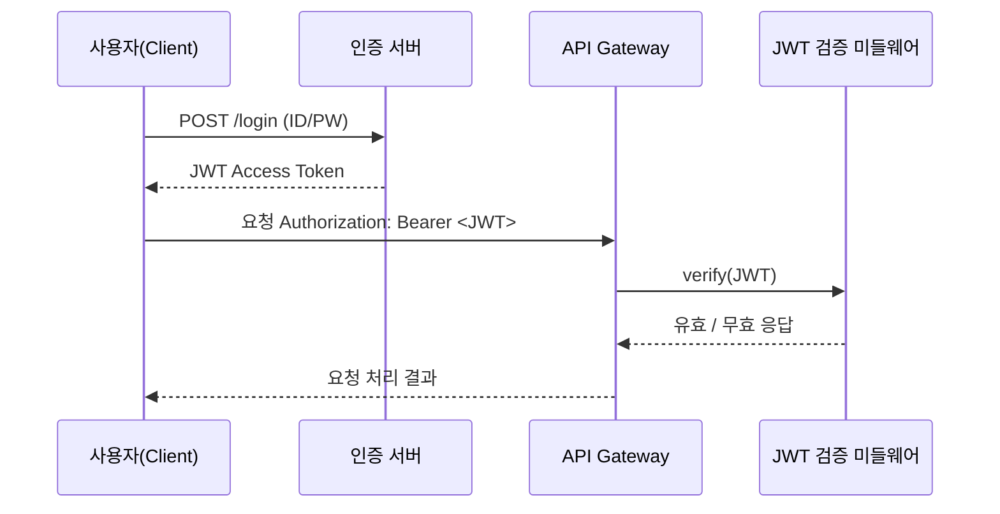
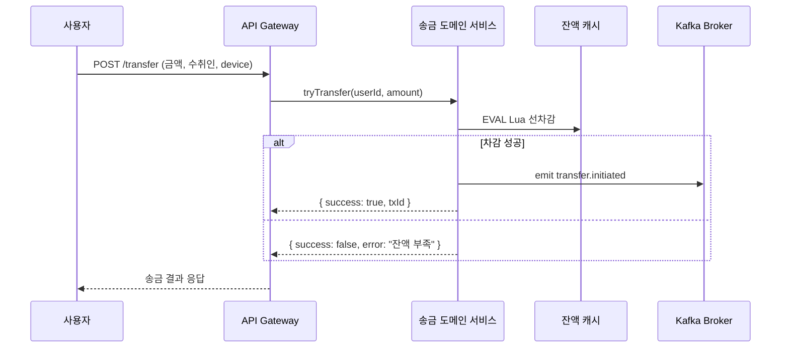
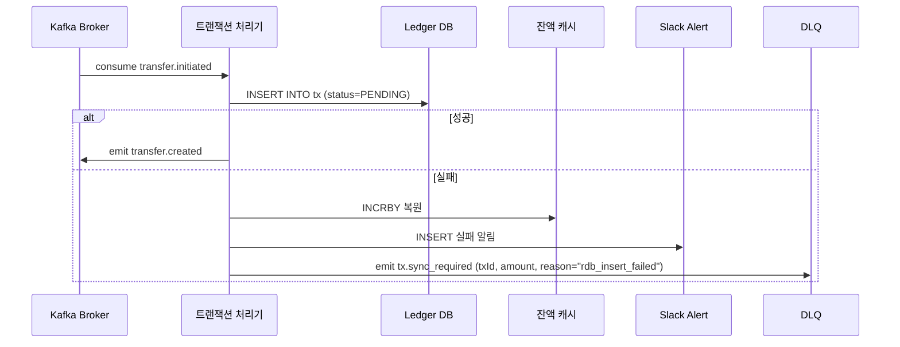
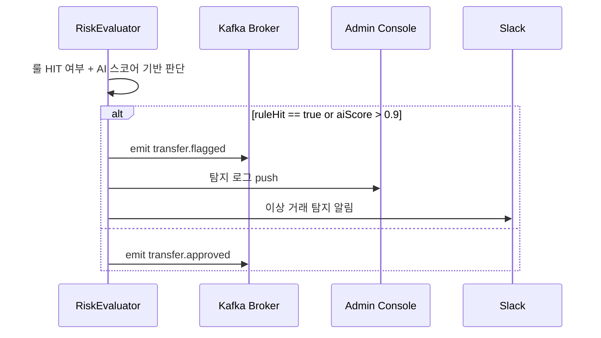
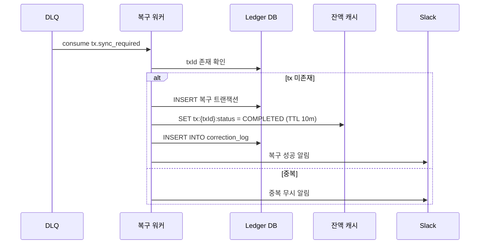

# 이상 거래 실시간 탐지 시스템 (FDS)

## 프로젝트 개요
사용자 거래에서 이상 징후를 실시간으로 감지하고, 관리자에게 알림과 리포트를 제공하는 FDS 시스템

## 목표

- Kafka 기반 이벤트 스트리밍 구조 설계
- Redis 기반 실시간 탐지 구조 구현
- 이상 거래 룰 기반 탐지 및 관리자 대시보드 구축
- 추후 AI 기반 탐지 확장이 가능한 형태로 설계
- 실시간성과 확장성을 고려한 아키텍처 실습

## 해결하고자 하는 문제

| 사례 | 설명 |
|------|------|
| 토스 | 3초 간격 5회 송금 시도 → 자동 차단 |
| 신한은행 | 새벽 2시 해외 결제 → 탐지 후 보류 |
| 카카오페이 | 낯선 기기에서 고액 결제 → 알림 후 차단 |

---

## 로그인 

## 송금 요청 및 트랜잭션

## TxWorker 처리 + 실패 시 DLQ emit

## RiskEval 판단 기준 명확화 + 상태 emit

## Fallback 처리 흐름 강화: TTL 키 + 중복 체크 포함

