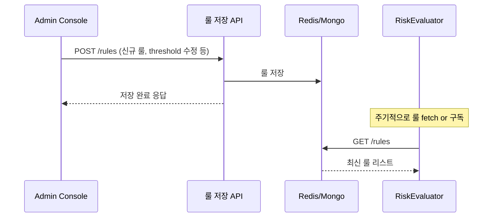
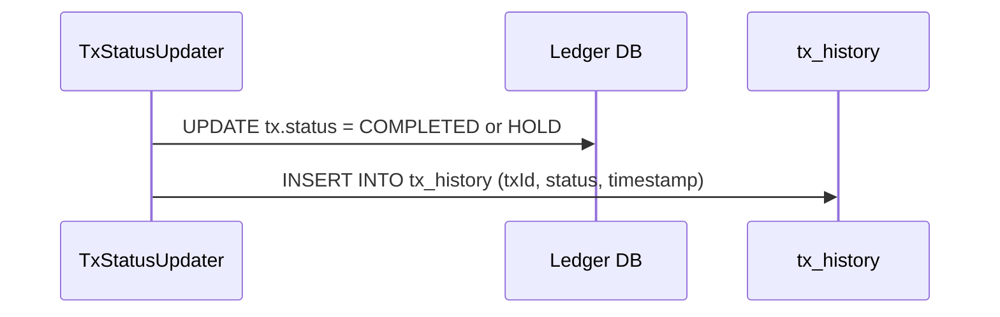
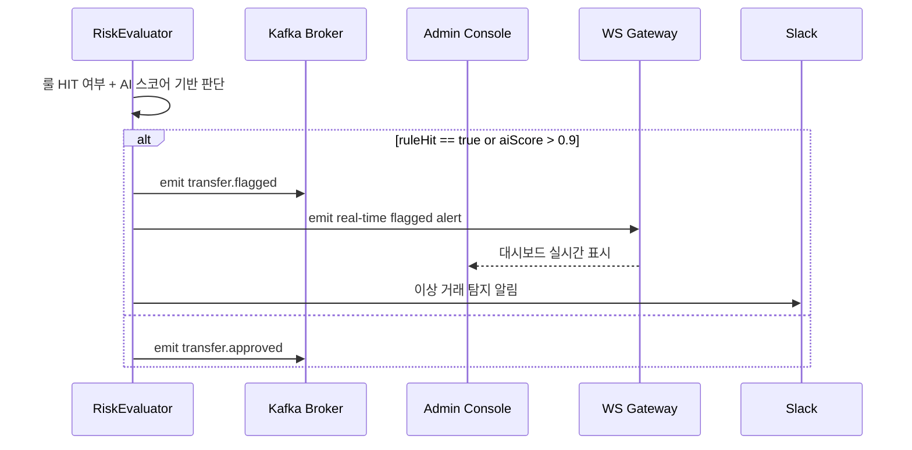

# 이상 거래 실시간 탐지 시스템 (FDS)

## 프로젝트 개요
사용자 거래에서 이상 징후를 실시간으로 감지하고, 관리자에게 알림과 리포트를 제공하는 FDS 시스템

> Kafka 기반 이벤트 스트리밍과 Redis 캐시, 룰/AI 기반 이상 거래 탐지 및 실시간 WebSocket 대시보드를 통해 운영성과 확장성을 갖춘 FDS 아키텍처입니다.

## 목표

- Kafka 기반 이벤트 스트리밍 구조 설계
- Redis 기반 실시간 탐지 구조 구현
- 이상 거래 룰 기반 탐지 및 관리자 대시보드 구축
- 추후 AI 기반 탐지 확장이 가능한 형태로 설계
- 실시간성과 확장성을 고려한 아키텍처 실습

## 해결하고자 하는 문제

| 사례 | 설명 |
|------|------|
| 토스 | 3초 간격 5회 송금 시도 → 자동 차단 |
| 신한은행 | 새벽 2시 해외 결제 → 탐지 후 보류 |
| 카카오페이 | 낯선 기기에서 고액 결제 → 알림 후 차단 |

---

## 로그인 

## 송금 요청 및 트랜잭션

## TxWorker 처리 + 실패 시 DLQ emit

## 룰 수정 및 반영 흐름 (Admin Console에서 룰 수정 → RiskEval 동기화 흐름 추가)

##  Tx 상태 변경시 tx_history 기록 흐름 추가

## RiskEval 판단 기준 명확화 + 상태 emit

## Fallback 처리 흐름 강화: TTL 키 + 중복 체크 포함

| Task        | 설명                                                     |   |                        |
| ----------- | ------------------------------------------------------ | - | ---------------------- |
| 로그인        | JWT 발급, 이후 인증 토큰 사용                                    |   |                        |
| 송금 요청      | TransferService가 Redis 차감 + Kafka 발행                   |   |                        |
| TxWorker   | DB에 트랜잭션 생성 + 실패 시 rollback                            |   |                        |
| FDS 탐지     | Rule + AI 기반 위험 평가 수행                                  |   |                        |
| RiskEval   | 판단 기준(ruleHit                                          |   | aiScore > 0.9)으로 상태 분기 |
| TxStatusUpdater | transfer.approved → status = COMPLETED, flagged → HOLD |   |                        |
| Fallback   | DLQ로 들어온 tx에 대해 복구 수행                                  |   |                        |
| Admin Console | 운영자가 rollback emit → 상태를 ROLLED\_BACK으로 바꿈             |   |                        |
