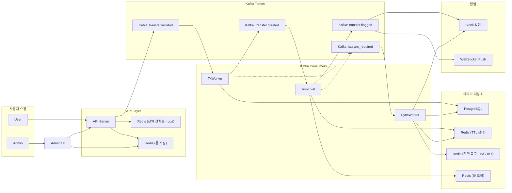

```mermaid
%% 카프카 기반 송금 흐름 (좌우 방향 & 도메인별 정리)
graph LR

%% 사용자 & API
subgraph 사용자 요청
  U[User]
  Admin[Admin]
end

subgraph API Layer
  API[API Server]
  RedisBalanceLua["Redis (잔액 선차감 - Lua)"]
  RedisRuleSet["Redis (룰 저장)"]
end

U --> API
API --> RedisBalanceLua
API --> RedisRuleSet
Admin --> AdminUI[Admin UI]
AdminUI --> API
AdminUI --> RedisRuleSet

%% Kafka Topics
subgraph Kafka Topics
  K1["Kafka: transfer.initiated"]
  K2["Kafka: transfer.created"]
  K3["Kafka: transfer.flagged"]
  DLQ["Kafka: tx.sync_required"]
end

API --> K1
K1 --> TxWorker
TxWorker --> K2
K2 --> RiskEval
RiskEval --> K3
TxWorker -.-> DLQ
RiskEval -.-> DLQ

%% Consumers
subgraph Kafka Consumers
  TxWorker["TxWorker"]
  RiskEval["RiskEval"]
  SyncWorker["SyncWorker"]
end

%% Redis + DB
subgraph 데이터 저장소
  DB["PostgreSQL"]
  RedisTTL["Redis (TTL 상태)"]
  RedisBalanceRestore["Redis (잔액 복구 - INCRBY)"]
  RedisRules["Redis (룰 조회)"]
end

TxWorker --> DB
RiskEval --> RedisTTL
RiskEval --> RedisRules

DLQ --> SyncWorker
SyncWorker --> DB
SyncWorker --> RedisTTL
SyncWorker --> RedisBalanceRestore

%% 알림
subgraph 알림
  Slack["Slack 알림"]
  WS["WebSocket Push"]
end

K3 --> Slack
K3 --> WS
SyncWorker --> Slack
```