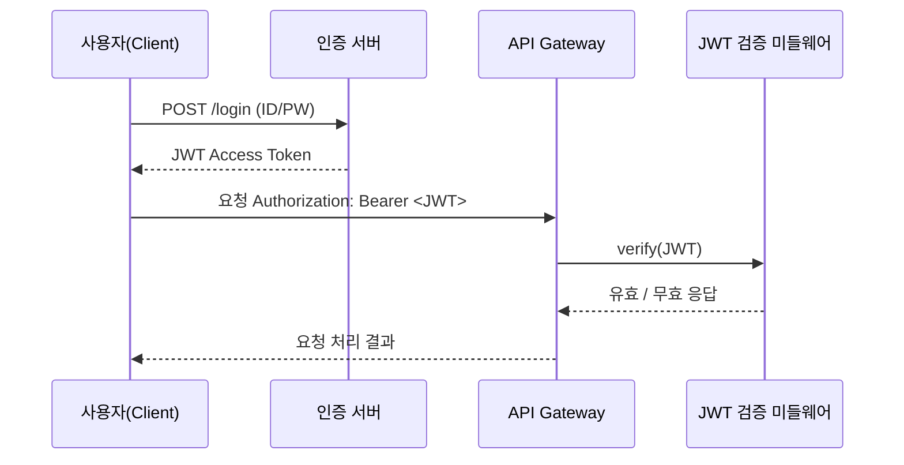
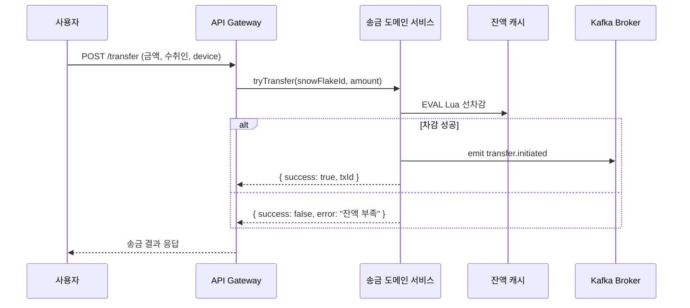
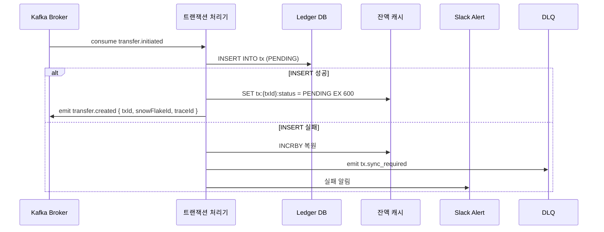
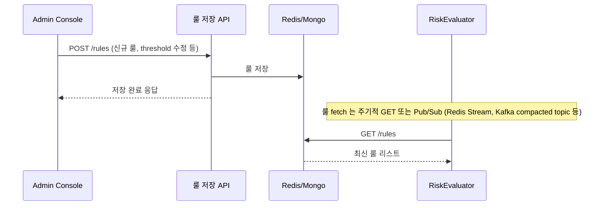
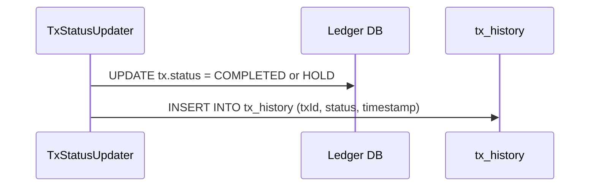
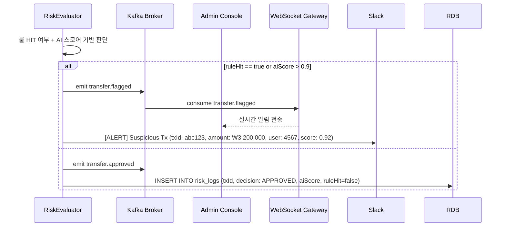
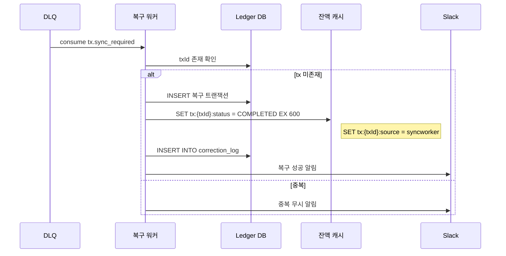

## 로그인

---

## 송금 요청 및 트랜잭션

- 설명:
    - 사용자가 송금 요청을 보내면 `TransferService`는 Redis에서 Lua 스크립트를 통해 잔액 선차감을 시도합니다.
    - 차감에 성공하면 `transfer.initiated` 이벤트를 Kafka로 발행하고,
      클라이언트에게는 **즉시 "송금 요청이 접수되었습니다"는 응답을 반환합니다.**
    - 이후의 실제 송금 처리(RDB insert 및 이상 거래 탐지)는 **비동기적으로 처리됩니다.**

> UX를 위해 빠르게 응답을 주되, 실제 송금 처리는 비동기로 넘깁니다.  
서버 리소스를 블로킹하지 않고 처리량을 확장할 수 있습니다.

---

## TxWorker 처리 + 실패 시 DLQ emit

- 설명:
    - TxWorker는 Kafka로부터 `transfer.initiated` 이벤트를 수신한 뒤, 해당 거래를 RDB에 `PENDING` 상태로 기록합니다.
    - 이 과정에서 DB 삽입이 실패할 경우, 다음과 같은 복구 절차가 순차적으로 수행됩니다.
        1. Redis에서 사용자 잔액을 복원 (`INCRBY`)
        2. `tx.sync_required` 이벤트를 DLQ로 발행하여 보정 처리 대상임을 명시
        3. 운영 Slack에 장애 알림을 전송하여 운영자가 즉시 인지할 수 있도록 합니다.

> RDB insert는 대체로 성공하지만, 네트워크 단절, DB pool 초과 등으로 실패할 경우 **금전 정합성 문제가 발생할 수 있습니다.**  
> 이를 대비해 **자동 복구 루틴 + 운영 알림 체계**를 구성하여, **손실 없이 보정 가능한 구조**입니다.

---
## 룰 수정 및 반영 흐름 (Admin Console에서 룰 수정 → RiskEval 동기화 흐름 추가)

- 설명:
    - 관리자(Admin)는 이상 거래 탐지 조건을 UI에서 직접 등록 또는 수정할 수 있으며,
      해당 요청은 RuleAPI 서버를 통해 처리됩니다.
    - RuleAPI는 수정된 룰 정보를 Redis나 MongoDB와 같은 RuleStore 에 저장하고, 결과를 관리자에게 응답으로 반환합니다.
    - `RiskEval` 서비스는 일정 주기로 RuleStore에서 최신 룰을 가져오거나 Pub/Sub 또는 변경 감지 방식으로 구독하고 있으며,
      이를 통해 **운영 중단 없이 실시간으로 탐지 기준을 업데이트할 수 있습니다.**

> 운영 중인 서비스의 룰을 실시간으로 수정할 수 있도록 구성함으로써,  
> **탐지 민감도 조절, 새로운 패턴 추가, 일시적 허용 등 운영 대응력을 허용합니다.**  
> 정적 룰 시스템이 아니라 **동적으로 구성 가능한 Rule Engine 구조**입니다.

---
##  Tx 상태 변경시 tx_history 기록 흐름 추가

- 설명:
    - 트랜잭션의 상태는 `PENDING → COMPLETED` 또는 `FLAGGED → HOLD` 등 다양한 흐름을 가지므로,
      단일 컬럼의 상태 업데이트만으로는 **이력 추적이 불가능합니다.**
    - 이를 해결하기 위해 `TxStatusUpdater`는 상태 변경 시마다 별도로 `tx_history` 테이블에 로그를 남깁니다.
    - tx_history 에는 `txId`, 변경된 `status`, `timestamp`가 포함되며,  
      모든 상태 변경은 별도로 기록되어 **이상 탐지, 운영 분석, VOC 대응, 회계 정산 등의 근거 자료로 활용**됩니다.

---
## RiskEval 판단 기준 명확화 + 상태 emit

- 설명:
    - `RiskEval`은 Kafka에서 `transfer.created` 이벤트를 consume한 후, 아래의 두 가지 기준으로 이상 여부를 판단합니다.
        1. **정적 Rule 기반 판단** (ex: 3초 내 5회 송금, 새벽 2시 이상 거래 등)
        2. **AI 모델 스코어** (ex: AI로부터 받은 이상도 점수가 0.9 이상일 경우)

    - 판단 결과에 따라 다음과 같은 이벤트가 Kafka로 emit됩니다:
        - 이상 없음: `transfer.approved`
        - 이상 탐지됨: `transfer.flagged`

    - `transfer.flagged`는 WebSocket Gateway가 구독하여 Admin UI에 실시간 알림을 전송하며,  
      동시에 Slack에도 이상 거래 탐지 알림이 전송되어 **운영자가 즉각 대응할 수 있도록 합니다.**

> 정적 룰 기반 탐지의 장점(명확함)과 AI 기반 이상도 판단의 장점(학습 기반)을 결합하여,  
> **탐지 민감도와 유연성을 모두 확보한 하이브리드 Risk 평가 시스템**입니다.

---
## Fallback 처리 흐름 강화: TTL 키 + 중복 체크 포함

- 설명:
    - `TxWorker`가 RDB INSERT에 실패하면, 보정 필요 상태로 판단해 `tx.sync_required` 이벤트를 Kafka DLQ에 발행합니다.
    - `SyncWorker`는 해당 DLQ를 consume하고 다음의 순서로 복구를 시도합니다:

        1. 먼저 `txId`에 해당하는 트랜잭션이 RDB에 이미 존재하는지 확인합니다.  
           → 이 과정을 통해 **중복 처리 방지**를 보장합니다.

        2. 존재하지 않는다면, 해당 송금 내용을 RDB에 복구용으로 INSERT합니다.  
           → 이때 상태는 `COMPLETED` 또는 `RESTORED`로 저장될 수 있습니다.

        3. Redis에 TTL이 있는 상태 키 (`tx:{txId}:status = COMPLETED`)를 설정하여  
           **동일 트랜잭션 중복 처리나 재요청을 방지**합니다. (TTL 10분 등)

        4. 보정 트랜잭션이 성공적으로 수행되면 `correction_log` 테이블에 복구 이력을 저장하고,  
           Slack 운영 알림을 발송해 **운영자가 상태를 즉시 인지**할 수 있도록 합니다.

> 복구 대상이 이미 존재한다면, 해당 트랜잭션은 "중복"으로 간주되며 Slack으로 무시 알림만 전송되고, **재처리는 일절 하지 않습니다.**
> 실패한 트랜잭션도 절대 유실되지 않도록 보장하며, **자동 복구 + 상태 키 TTL + 이력 로깅 + 알림**까지 포함된 Failsafe 구조입니다.
