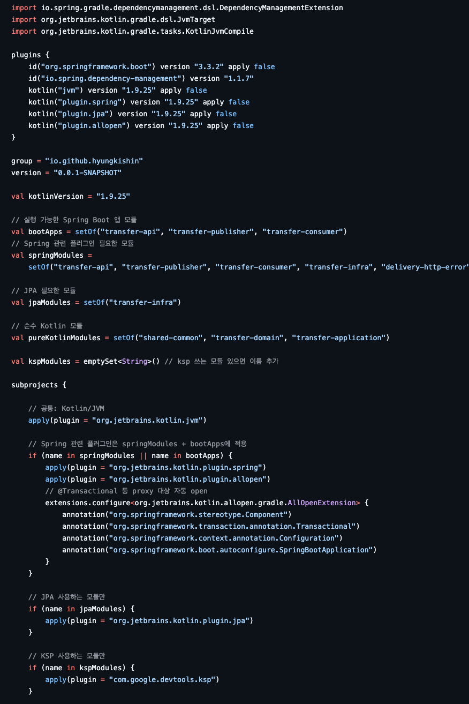

# 돼지같은 Root build.gradle 을 다이어트 시켜보자.

처음엔, Jacoco 테스트 제외 대상의 파일만을 프로젝트만을 담당하여 root gradle 에서 의존하여 사용하고 있었으나.  
프로젝트 진행률이 올라가면서 다양한 모듈이 생기다보니, 반복적인 의존 패턴이 보이기 시작했다.

**도메인 마다 공통적인 성격의 모듈** 을 도식화 하면 다음과 같다.

```text
( 송금 도메인 )
transfer        
ㄴ api           ( controller ) 
ㄴ domain        ( 도메인 비즈니스 로직을 처리 )
ㄴ application   ( 어플리 케이션 비즈니스 로직을 처리 )
ㄴ infra         ( rdb, kafka 이벤트 발행을 담당 )

( 송금 이상감지 도메인 )
fds        
ㄴ api           ( controller ) 
ㄴ domain        ( 도메인 비즈니스 로직을 처리 )
ㄴ application   ( 어플리 케이션 비즈니스 로직을 처리 )
ㄴ infra         ( rdb, kafka 이벤트 발행을 담당 )

```  

fds 도메인이 추가되면서 공통 의존 설정을 root build.gradle에서 처리했는데,
결과적으로 파일이 점점 비대해졌다.


> 그 아래엔 jacoco 설정과 아직 보이지 않은 각종 설정이 더 붙어 있다.

<br/>

이미 Jacoco 제외 설정도 buildSrc로 해결한 경험이 있었다.  
그러니 root Gradle 내용도 정리해서 buildSrc로 옮기면 .  


이 당시 손절 대응 잘했던것 같다..  
"이런 고민 나만 하냐" 라는 생각으로 검색을 해보니 대안이 있었다.  

Gradle 팀은 이를 대체할 수 있는 새로운 구조인 `build-logic` 을 잘 맨들어 놓았다.

---

## buildSrc
Gradle 프로젝트를 운영하다 보면 `buildSrc`는 한 번쯤 마주치게 된다고 한다. <strike>( 나는 아무래도 관심이 없었나보다 )</strike>

공통 빌드 로직을 모듈화하기 위해 가장 손쉬운 선택지였고, 실제로 많은 프로젝트에서 관성적으로 사용됐다.  
그러나 `buildSrc`는 편리함 뒤에 여러 가지 문제를 품고 있었다.

### 동작 방식
- Gradle은 루트 디렉토리에 buildSrc/ 폴더가 있으면 특수 취급한다.
- 내부 코드를 자동으로 빌드하고, 메인 빌드 시작 전에 classpath에 추가한다.
- 즉, 메인 빌드와 붙어서 움직이는 내장 빌드다.

> 문제는, buildSrc가 조금이라도 바뀌면 모든 모듈 빌드가 다시 수행되고, 캐싱이나 분리 빌드가 불가능하다는 점이다.

### "자동성"이 가져오는 부작용

**재빌드 비용** : `buildSrc`에 조금이라도 코드가 바뀌면 전체 프로젝트 빌드에 영향을 준다.  
단순히 주석을 수정해도 캐시가 무효화되어 불필요한 리빌드가 발생한다.

**명시적이지 않은 의존성** : 모듈에서 `buildSrc`의 클래스를 참조할 수 있지만, 어디에서 어떻게 공급되는지 코드만 보고는 알기 어렵다.  
고로, 빌드 스크립트의 투명성이 떨어진다.

**점점 커지는 빌드 로직** : 프로젝트가 성장할수록 `buildSrc`는 다양한 규칙과 설정을 집어넣는 창고가 된다.  
결국 관리하기 어려운 "또 하나의 거대한 모듈"이 되어버린다.

이러한 부작용이 있는 까닭에 해결점이 이미 존재 했었는데, 그게 바로 build-logic 이다. 

---

## build-logic
> 학습의 연속이란 ... 짜릿하다.


Gradle 7 이후부터는 `build-logic`이라는 새로운 방식이 권장된다.  
buildSrc 와 같이 둘 다 **"빌드 스크립트 재사용"** 이라는 공통 목표는 같지만, 

동작 방식은 전혀 다른데 아래와 같은 차이점이 존재한다.

| 구분    | buildSrc         | build-logic         |
| ----- | ---------------- | ------------------- |
| 위치    | 루트 디렉토리의 특수 디렉토리 | 독립된 Gradle 빌드       |
| 동작 방식 | 자동 classpath 주입  | Composite Build로 연결 |
| 투명성   | 암묵적              | 명시적 (`plugins {}`)  |
| 캐시 활용 | 불리               | 유리                  |
| 권장 여부 | 과거엔 기본, 지금은 비권장  | 공식 권장               |

- `build-logic`은 프로젝트의 루트에 위치한 별도의 빌드다.
- 플러그인이나 설정을 Gradle Plugin으로 정의하고, 필요한 프로젝트에서 `plugins` 블록으로 명시적으로 가져온다.
- `settings.gradle.kts`의 `includeBuild("build-logic")`을 통해 연결한다.

> 즉, 명시적이고 독립적인 플러그인 프로젝트다.

### build-logic의 동작 방식

build-logic은 일반 Gradle 프로젝트와 동일하다.

settings.gradle.kts에서 includeBuild("build-logic")을 선언하면,  
메인 빌드와 Composite Build 관계로 연결된다.

즉, 서브 빌드가 독립적으로 존재하고, 필요한 경우에만 classpath에 합쳐진다.

### 장점
- build-logic이 바뀌지 않으면 메인 빌드는 캐시된 상태로 그대로 실행 가능.
- build-logic 자체를 별도의 버전 관리나 테스트 대상으로 분리할 수 있음.
- 플러그인처럼 id("...")로 명시적으로 적용해야 한다.

> 단점은 모르겠다.
---

## 구조 비교

### 기존 buildSrc
```
root
 ├─ buildSrc
 │   └─ src/main/kotlin
 │       └─ Jacoco 설정 관련.kt
...
```

### 새로운 build-logic
```
root
 ├─ build-logic
 │   └─ convention
 │       ├─ build.gradle.kts
 │       └─ src/main/kotlin/데헷_나만의_컨벤션_Plugin.kt
 ...
```

그리고 `settings.gradle.kts`에 다음을 추가한다.
```kotlin
includeBuild("build-logic")
```

이제 `app/build.gradle.kts`에서는 다음과 같이 쓸 수 있다.
```kotlin
plugins {
    id("데헷.나만의_컨벤션_룰루")
}
```

---

## 왜 build-logic이 더 나을까?

**빌드 캐시 활용** : `build-logic`은 Composite Build로 동작하기 때문에 변경되지 않은 경우 캐시를 그대로 활용하여 빌드 속도가 빨라진다.

**명시적 플러그인 사용** : `plugins` 블록에 선언해야만 적용되고, 어느 모듈이 어떤 규칙을 따르는지 투명하다.

**관심사의 분리** : `build-logic` 내부를 플러그인 단위로 나누어 관리할 수 있다.    
공통 규칙을 `spring-library`, `kotlin-library`, `root-conventions`처럼 명확히 분리 가능하다.

**점진적 도입 가능** : 기존 `buildSrc`에서 점차 옮겨도 된다.  
특정 규칙만 먼저 `build-logic`으로 옮겨보면서 이점을 체감할 수 있다.

---

## 도입 전략

**작은 플러그인으로 쪼개기**  
기존 `buildSrc`를 그대로 옮기지 말고, 도메인별로 나눈다.  
예: `spring-library`, `kotlin-library`, `root-conventions`.

**의존성 관리도 위임 하기**  
BOM이나 공통 라이브러리 정의도 `build-logic`으로 옮길 수 있다.  
개별 모듈은 더 이상 버전 번호를 알 필요가 없다.

**CI/CD와 통합하기**  
캐시를 적극 활용하기 위해 빌드 서버 환경에서도 `build-logic`이 독립된 캐시 단위로 동작함을 확인한다.

---

## 결론


build-logic 계층별 필수 의존성을 보기좋게 쓰는 컨셉 자체는 너무 좋다.

그러나, 어떤 의존이 들어갔는지 보고싶을 니즈 도 있을것 같다.

취향의 영역일까 ? 아니면 반 강제적으로 만들어 놓은 산출물에 기술 부채가 쌓일수 있는 위험요소를 만든것일까? 
라는 생각이 들었고, 지금은 진행이 많이 늦어진 상황이라.

얼른 진행률을 높인다음.   
이를 해결할 방법을 찾아봐야겠다.  
손좀 보고 이 글로 다시 와서 정리하는 것이 좋겠다.  

---
## 딴생각

아니 근데 왜, 안드로이드 기반 프로젝트에 적용한 사례의 블로그만 보였었을까 ?
궁금해서 이것저것 찾아보니, 

그 이유는 안드로이드는 사실 Gradle 의존성이 절대적이여서 이였다.

게다가 Maven 기반 이 아니라 Gradle을 강제적으로 사용하다 보니,  
Gradle 플러그인/빌드 로직을 깊게 커스터마이징하는 일이 많다고 한다.

그 과정에서 buildSrc 한계가 있었고, build-logic 전환 사례가 풍부하게 쌓였나보다.  

나의 경우는 헥사고날 계층별로 적용해야 할 규칙이 달라지는 경우라, 잘 적용한 듯 싶으면서도.

> kafka module 을 정리하다보니, 좀 과하게 적용한것 같은 생각에 살짝 아차 싶다.