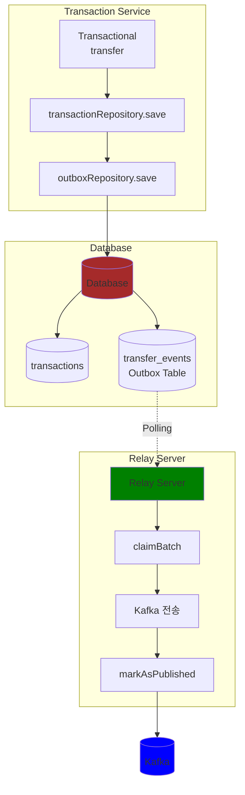
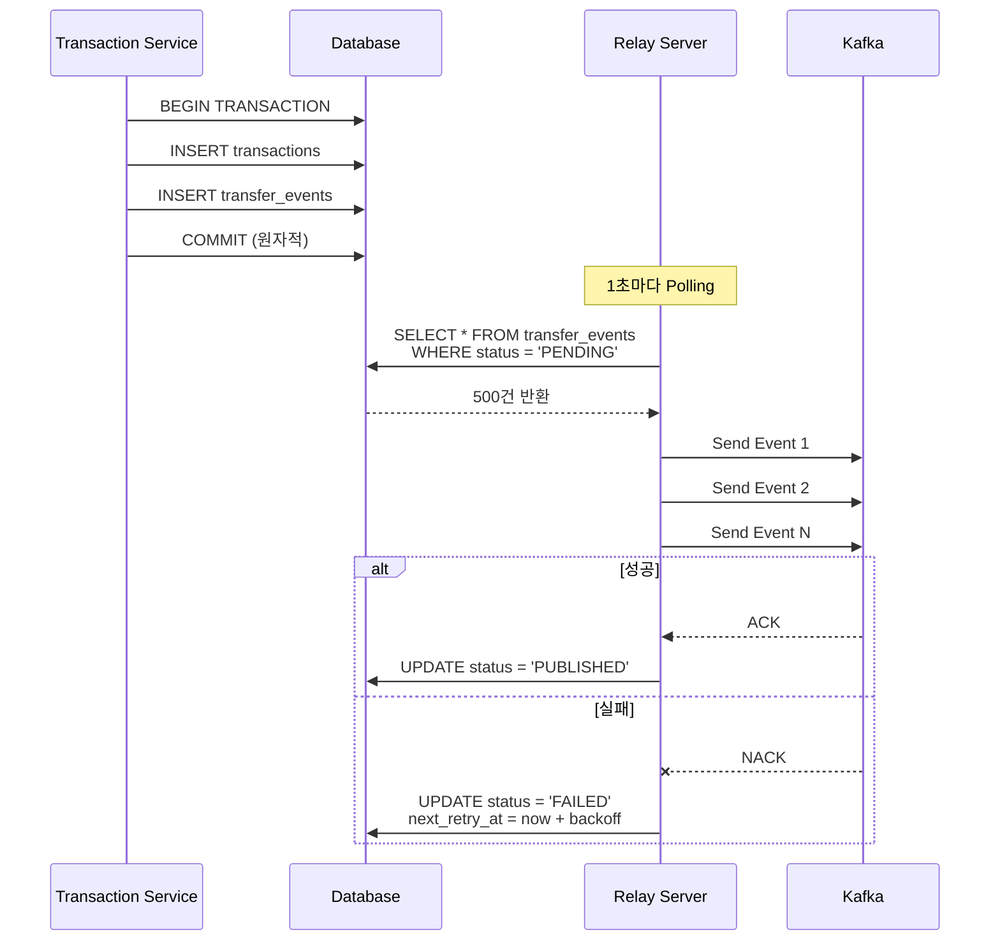
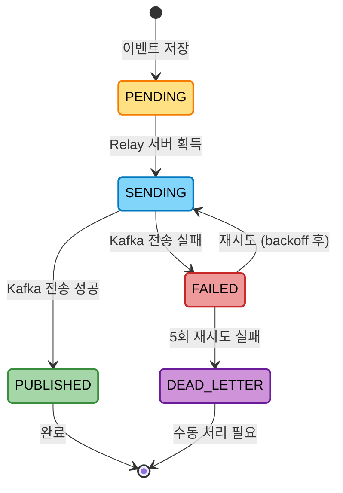
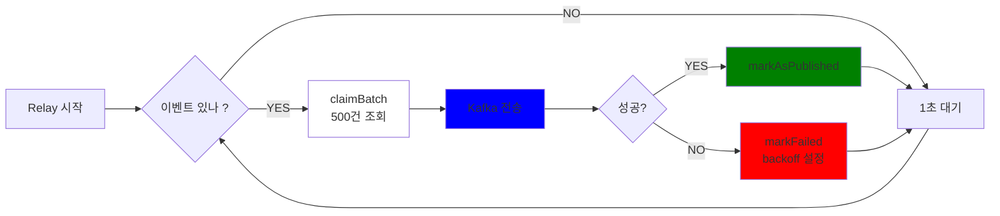
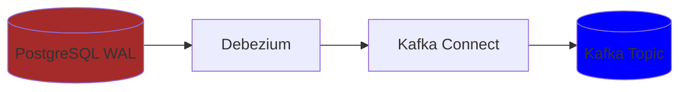
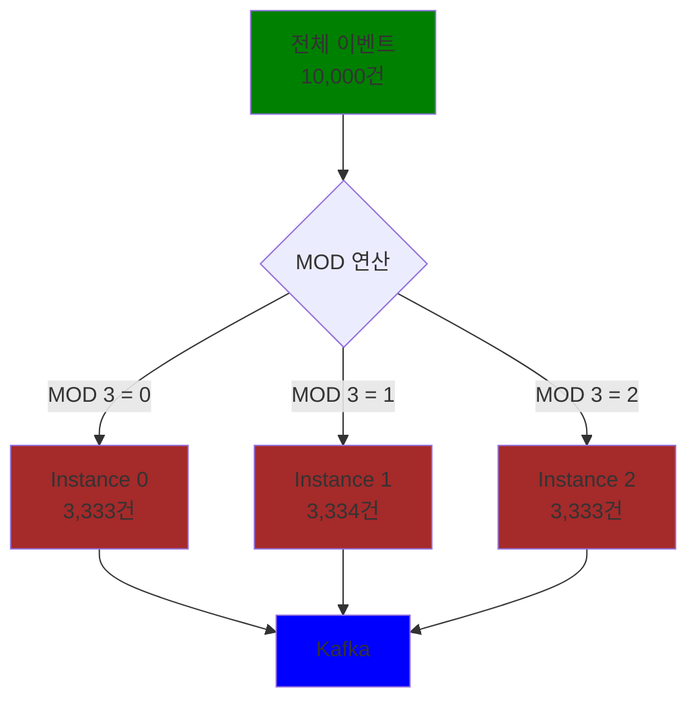

# Outbox Pattern 설계

## 개요

Transactional Outbox Pattern은 마이크로서비스 아키텍처에서 데이터베이스 트랜잭션과 메시지 발행의 원자성을 보장하기 위한 패턴입니다.

---

## 1. 문제 상황

### 1.1 일반적인 이벤트 발행 방식의 문제

```kotlin
@Transactional
fun transfer(command: TransferCommand) {
    // 1. DB 저장
    transactionRepository.save(transaction)
    
    // 2. Kafka 발행
    kafkaTemplate.send("transfers", event)  // 실패 시 문제 발생
}
```

**문제점**

- DB 저장은 성공했는데 Kafka 발행 실패 → 데이터 불일치
- Kafka 발행은 성공했는데 DB 저장 실패 → 중복 이벤트
- 트랜잭션 롤백 시 이미 발행된 메시지 취소 불가

### 1.2 장애 시나리오

**시나리오 1: Kafka 장애**

```
10:00:00 - 송금 요청
10:00:01 - DB 저장 성공 (COMMIT)
10:00:02 - Kafka 전송 시도... 실패 (Kafka Down)

결과:
  DB: 송금 완료
  Kafka: 이벤트 없음
  FDS: 탐지 불가 → 데이터 유실
```

**시나리오 2: 애플리케이션 재시작**

```
10:00:00 - 송금 요청
10:00:01 - DB 저장 성공
10:00:02 - Kafka 전송 시도 중...
10:00:03 - 애플리케이션 강제 종료 (배포)

결과:
  DB: 송금 완료
  Kafka: 이벤트 없음 → 영구 유실
```

---

## 2. Outbox Pattern 해결 방법

### 2.1 전체 아키텍처



### 2.2 해결 포인트

**1. 트랜잭션 원자성**

```kotlin
@Transactional
fun transfer(command: TransferCommand) {
    // 하나의 트랜잭션으로 묶임
    val transaction = Transaction.of(...)
    transactionRepository.save(transaction)
    
    val event = TransferCompleteEvent.from(transaction)
    outboxRepository.save(event)
    
    // 둘 다 성공하거나, 둘 다 실패
}
```

**2. At-Least-Once 보장**



- Outbox에 저장된 이벤트는 반드시 발행됨
- Relay 서버가 자동 재시도
- Kafka 장애 시에도 안전

**3. 멱등성 처리**

```kotlin
// Consumer에서 중복 방지
@KafkaListener(topics = ["transfers"])
fun handle(event: TransferEvent) {
    // 이미 처리했는지 확인
    if (processedEventIds.contains(event.eventId)) {
        return // 중복 무시
    }
    
    // 처리
    analyzeTransfer(event)
    processedEventIds.add(event.eventId)
}
```

---

## 3. Outbox 테이블 설계

### 3.1 스키마

```sql
CREATE TABLE transfer_events (
    event_id BIGSERIAL PRIMARY KEY,
    aggregate_type VARCHAR(50) NOT NULL,     -- 'Transfer'
    aggregate_id VARCHAR(100) NOT NULL,      -- Transaction ID
    event_type VARCHAR(50) NOT NULL,         -- 'TransferCompleted'
    payload TEXT NOT NULL,                   -- JSON 페이로드
    headers TEXT,                            -- 메타데이터 (선택)
    
    -- 상태 관리
    status VARCHAR(20) NOT NULL DEFAULT 'PENDING',
    attempt_count INT NOT NULL DEFAULT 0,
    next_retry_at TIMESTAMP NOT NULL DEFAULT NOW(),
    
    -- 타임스탬프
    created_at TIMESTAMP NOT NULL DEFAULT NOW(),
    updated_at TIMESTAMP NOT NULL DEFAULT NOW(),
    published_at TIMESTAMP,
    
    -- 에러 추적
    last_error TEXT
);

-- 인덱스
CREATE INDEX idx_transfer_events_status ON transfer_events(status);
CREATE INDEX idx_transfer_events_next_retry ON transfer_events(next_retry_at);
CREATE INDEX idx_transfer_events_created ON transfer_events(created_at);
```

### 3.2 상태 흐름



---

## 4. Relay 서버 구현

### 4.1 Polling 방식

```kotlin
@Component
class TransferOutboxRelay(
    private val outboxRepository: TransferEventsOutboxRepository,
    private val kafkaTemplate: KafkaTemplate<String, TransferEvent>
) {
    
    @Scheduled(fixedDelay = 1000)  // 1초마다
    fun poll() {
        // 1. 미발행 이벤트 조회
        val events = outboxRepository.claimBatch(
            limit = 500,
            status = "PENDING"
        )
        
        if (events.isEmpty()) return
        
        // 2. Kafka 전송
        events.forEach { event ->
            try {
                kafkaTemplate.send("transfers", event)
                outboxRepository.markAsPublished(event.id)
            } catch (e: Exception) {
                // 3. 실패 시 재시도 설정
                outboxRepository.markFailed(event.id, e.message)
            }
        }
    }
}
```

### 4.2 처리 흐름



### 4.3 CDC 방식 일 경우

- 추가 학습이 필요하지만, 도식화 한다면 다음과 같습니다.



**장점**

- Polling 오버헤드 없음
- 실시간 ( 수십 ms)
- Relay 서버 불필요 ( fade out )

**단점**

- 복잡한 설정
- WAL 관리 필요
- 운영 비용 증가
  - 학습 곡선 추가
  - 돈

---

## 5. 재시도 전략

### 5.1 지수 백오프 (Exponential Backoff)

```kotlin
fun calculateBackoff(attemptCount: Int): Duration {
    val base = 2.seconds
    val multiplier = 2.0
    val max = 10.minutes
    
    val backoff = base * multiplier.pow(attemptCount)
    return min(backoff, max)
}
```

**재시도 스케줄**

| 시도 | 대기 시간 |
|------|-----------|
| 1차 실패 | 2초 후 |
| 2차 실패 | 4초 후 |
| 3차 실패 | 8초 후 |
| 4차 실패 | 16초 후 |
| 5차 실패 | 32초 후 |
| 6차 실패 | 10분 (max) |

### 5.2 Dead Letter Queue

```kotlin
@Scheduled(fixedDelay = 1000)
fun poll() {
    val events = outboxRepository.claimBatch(500)
    
    events.forEach { event ->
        if (event.attemptCount >= 5) {
            // 5번 재시도 실패 -> DLQ로 이동
            outboxRepository.moveToDeadLetter(event.id)
            alertService.notifyOps("Event ${event.id} moved to DLQ")
            return
        }
        
        // 정상 처리...
    }
}
```

---

## 6. 성능 최적화

### 6.1 배치 처리

```kotlin
// 나쁜 예: 1건씩 처리
events.forEach { event ->
    kafkaTemplate.send("transfers", event)
    outboxRepository.markAsPublished(event.id)
}

// 좋은 예: 배치 처리
val futures = events.map { event ->
    kafkaTemplate.send("transfers", event)
}

CompletableFuture.allOf(*futures.toTypedArray()).get()

val successIds = events.filter { /* 성공 확인 */ }.map { it.id }
outboxRepository.markAsPublished(successIds)  // 배치 업데이트
```

### 6.2 파티셔닝

```kotlin
// 여러 인스턴스가 서로 다른 이벤트 처리
SELECT * FROM transfer_events
WHERE status = 'PENDING'
AND MOD(event_id, :totalInstances) = :instanceId
FOR UPDATE SKIP LOCKED
LIMIT 500
```



### 6.3 인덱스 설정

```sql
-- 자주 조회하는 조건에 인덱스
CREATE INDEX idx_outbox_pending 
ON transfer_events(status, next_retry_at)
WHERE status IN ('PENDING', 'FAILED');
```

---

## 7. 장단점

### 7.1 Outbox 패턴 장점

- 트랜잭션 원자성 보장
- At-Least-Once 보장
- 이벤트 유실 방지
- 장애 복구 자동화
- 메시지 순서 보장 (ID 기준)

### 7.2 Outbox 패턴 단점

- 추가 테이블 필요
- Relay 서버 관리
- Polling 오버헤드
- 지연 시간 (최대 1초)
- 중복 발행 가능 (멱등성 필요)

---

## 8. 고려사항

### 8.1 이벤트 정리 (Cleanup)

```kotlin
@Scheduled(cron = "0 0 2 * * ?")  // 매일 새벽 2시
fun cleanup() {
    // 7일 이상 지난 발행 완료 이벤트 삭제
    outboxRepository.deleteOldEvents(
        status = "PUBLISHED",
        olderThan = 7.days
    )
}
```

### 8.2 모니터링

```kotlin
@Scheduled(fixedDelay = 60000)  // 1분마다
fun monitor() {
    val metrics = outboxRepository.getMetrics()
    
    // 알림
    if (metrics.pendingCount > 10000) {
        alertService.notify("Outbox 적체: ${metrics.pendingCount}건")
    }
    
    if (metrics.failedCount > 100) {
        alertService.notify("실패 이벤트: ${metrics.failedCount}건")
    }
}
```

### 8.3 멱등성 보장

```kotlin
// Consumer에서 처리
@KafkaListener(topics = ["transfers"])
fun handle(event: TransferEvent) {
    // 이미 처리했는지 확인
    val existing = riskLogRepository.findByEventId(event.eventId)
    if (existing != null) {
        log.info("Already processed: ${event.eventId}")
        return  // 중복 무시
    }
    
    // 처리
    val riskLog = analyzeTransfer(event)
    riskLogRepository.save(riskLog)
}
```

---

## 9. 참고 자료
- [Outbox pattern - RIDI](https://ridicorp.com/story/transactional-outbox-pattern-ridi/)
- [Microservices Patterns - Chris Richardson](https://microservices.io/patterns/data/transactional-outbox.html)
- [Debezium Documentation](https://debezium.io/)


송금 증액 차감 아웃박스 테이블에 저장. 
- 프로듀서 (publish 행위) -> relay (파티셔닝 되어있는) 서버 에서 fds 서버에게 송금이 이루어진 이벤트 객체를 쏴줘요 !
  - -> 브로커에 / 토픽 / 파티션션에 분산해서 메세지를 저장하는 행위 .  

- 컨슈머 (subscribe 행위) -> fds 서버 입장에서 에서 이벤트를 소비해야함.
  - pull 방식으로 브로커 / 토픽 / 파티션 메세지를 가져감
  - 어느정도 읽을꺼야 ? -> 500 개 씩 읽음


