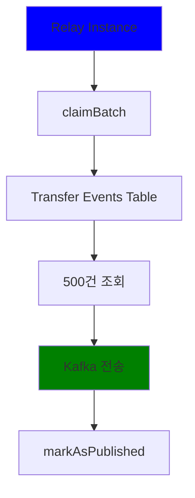
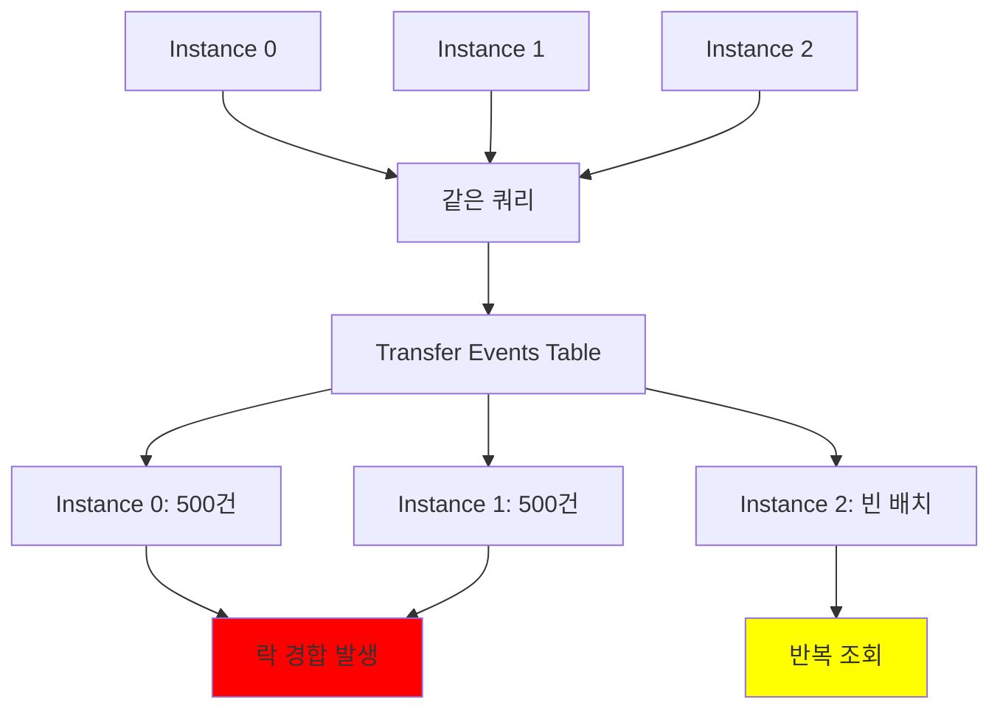
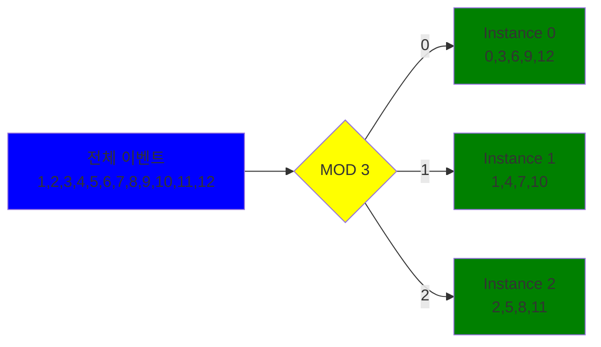
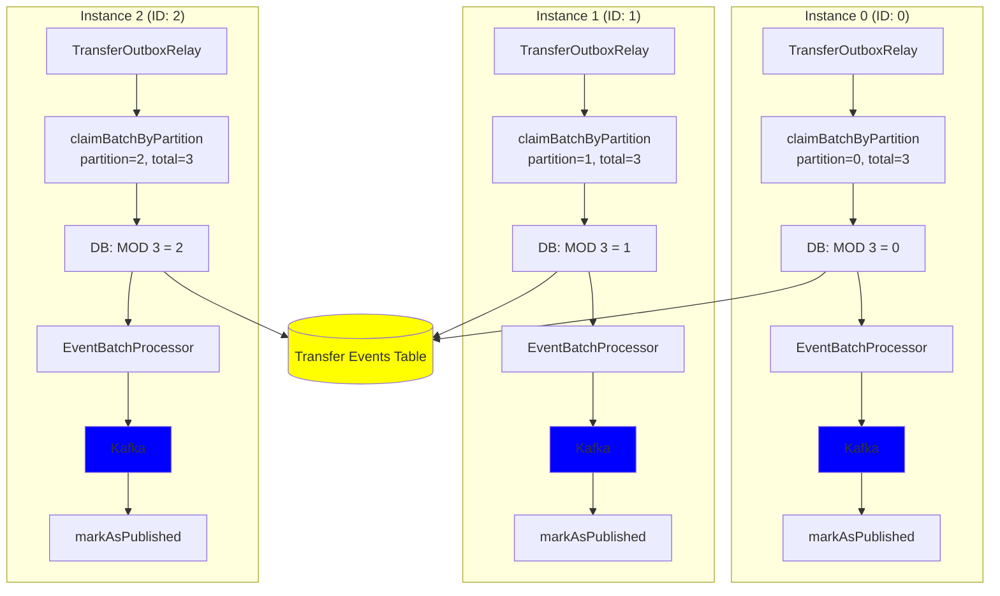
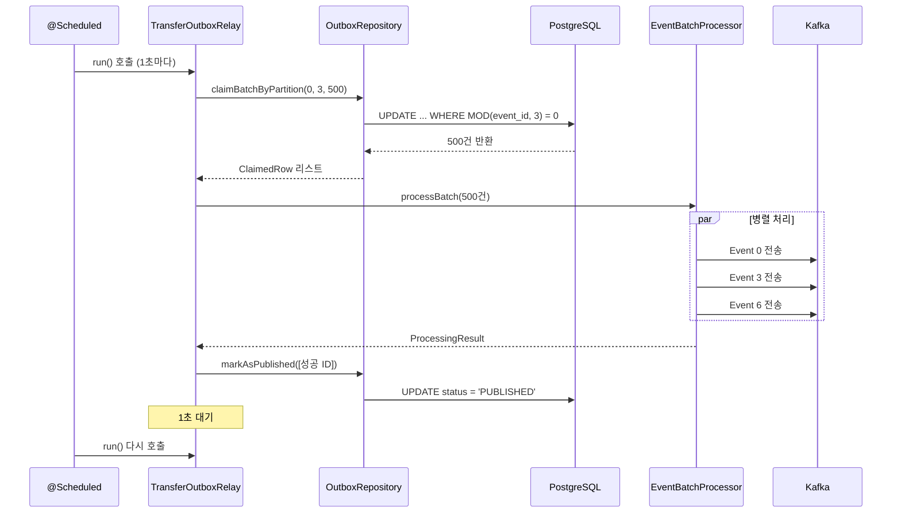
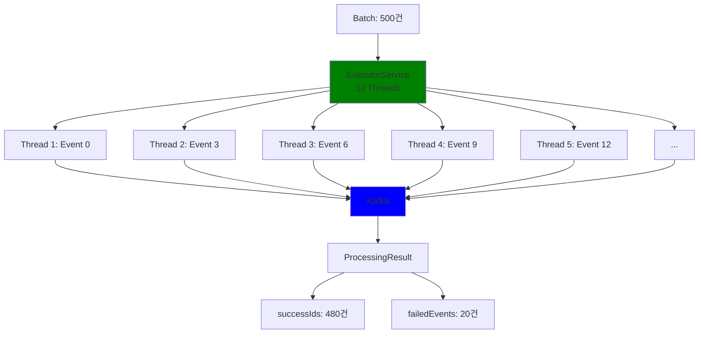
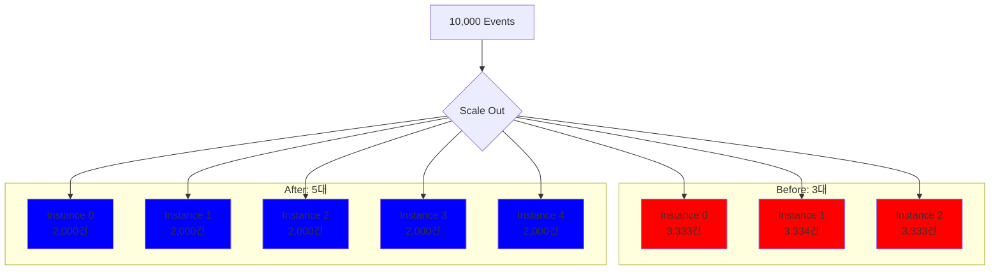
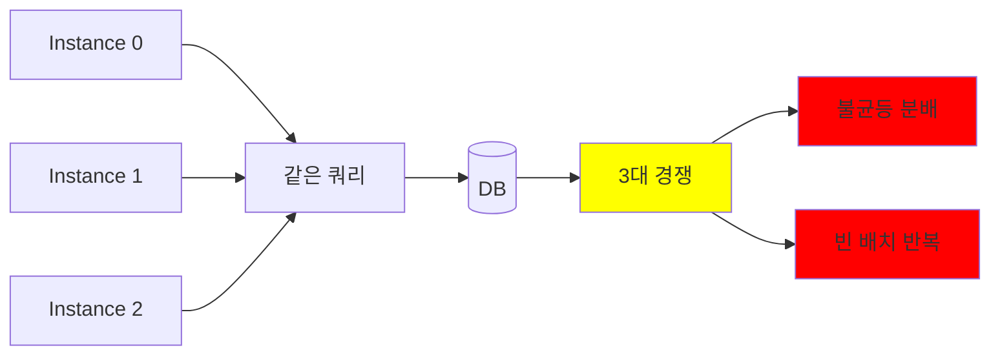
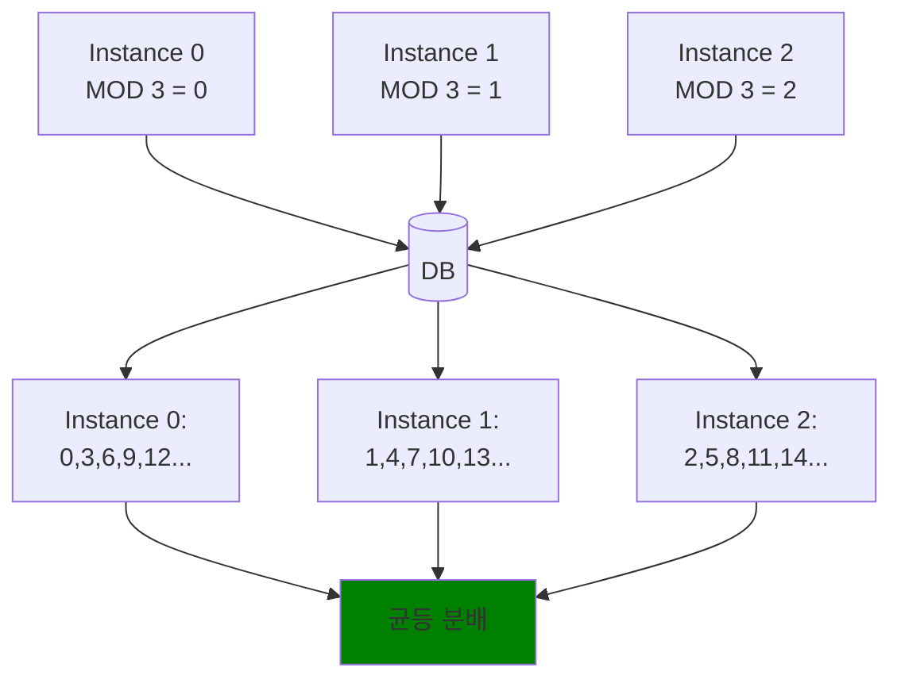

# Outbox 패턴 파티셔닝 구현 기록

## 목차

1. [들어가며](#들어가며)
1. [문제](#문제)
2. [해결 방안](#2-해결-방안)
3. [구현 상세](#3-구현-상세)
4. [실행 흐름](#4-실행-흐름)
5. [성능 테스트](#5-성능-테스트)
6. [배포 전략](#6-배포-전략)
7. [핵심 정리](#7-핵심-정리)

---

## 들어가며
transfer(송금) 서버에서 송금이 이루어 진 다음 fds 이상감지 탐지 시스템에 송금 데이터를 송신합니다.

이때, 카프카 서버

## 문제

### 1.1 초기 구현의 한계

단일 인스턴스 환경에서는 문제가 없었던 Outbox Relay가 스케일 아웃 시 심각한 성능 저하를 겪습니다.

**초기 Repository 구현**

```kotlin
fun claimBatch(limit: Int, now: Instant): List<ClaimedRow> {
    val sql = """
        UPDATE transfer_events
        SET status = 'SENDING', updated_at = :now
        WHERE event_id IN (
            SELECT event_id
            FROM transfer_events
            WHERE status = 'PENDING'
              AND next_retry_at <= :now
            ORDER BY event_id
            LIMIT :limit
            FOR UPDATE SKIP LOCKED
        )
        RETURNING event_id, aggregate_id, payload, headers
    """
}
```

**단일 인스턴스 환경**



처리량: 200 TPS, 부하: 40%, 문제 없음

**3대 인스턴스 환경 (스케일 아웃)**



### 1.2 실제 발생한 문제

**성능 테스트 결과 (Before)**

```
총 이벤트: 10,000건
총 처리 시간: 18,360ms

처리 분포:
  Instance 0: 3,000건 (30.0%)
  Instance 1: 3,000건 (30.0%)
  Instance 2: 2,000건 (20.0%)  <- 불균등 발생

DB 쿼리 수:
  Instance 0: 12회
  Instance 1: 3회
  Instance 2: 1,658회  <- 빈 배치 반복 조회
  총 쿼리: 1,673회
```

**문제점 분석**

1. **락 경합**: 3대가 같은 행을 잡으려고 경쟁
2. **불균등 분배**: 빠른 인스턴스가 많이 가져감
3. **무의미한 DB 스캔**: Instance 2가 1,658회 빈 배치 조회
4. **리소스 낭비**: CPU와 DB 커넥션 낭비

---

## 2. 해결 방안

### 2.1 파티셔닝 개념

전체 이벤트를 MOD 연산으로 분할하여 각 인스턴스가 겹치지 않는 이벤트만 처리하도록 합니다.



### 2.2 MOD 연산 원리

Instance 0 (partition=0, totalPartitions=3)  
- 결과: 0, 3, 6, 9, 12, 15, 18, 21...
```sql
WHERE MOD(event_id, 3) = 0
```

Instance 1 (partition=1, totalPartitions=3)
- 결과: 1, 4, 7, 10, 13, 16, 19, 22...

```sql
WHERE MOD(event_id, 3) = 1
```

Instance 2 (partition=2, totalPartitions=3)
- 결과: 2, 5, 8, 11, 14, 17, 20, 23... 
```sql
WHERE MOD(event_id, 3) = 2
```
<br/>
각 인스턴스가 서로 겹치지 않는 이벤트를 처리하므로 락 경합이 발생하지 않습니다.

---

## 3. 코트레벨 에서의 구현 상세

### 3.1 Repository 인터페이스 확장

```kotlin
interface TransferEventsOutboxRepository {
    /**
     * 파티셔닝 없이 배치 조회 (레거시)
     */
    fun claimBatch(
        limit: Int,
        now: Instant,
    ): List<ClaimedRow>

    /**
     * 파티셔닝 적용 배치 조회 (신규)
     * 
     * @param partition 현재 인스턴스의 파티션 ID (0, 1, 2...)
     * @param totalPartitions 전체 인스턴스 수
     * @param limit 한 번에 조회할 최대 이벤트 수
     * @param now 기준 시간
     * @return 처리할 이벤트 목록
     */
    fun claimBatchByPartition(
        partition: Int,
        totalPartitions: Int,
        limit: Int,
        now: Instant,
    ): List<ClaimedRow>

    fun markAsPublished(ids: List<Long>, now: Instant)
    
    fun markFailedWithBackoff(
        id: Long,
        cause: String?,
        backoffMillis: Long,
        now: Instant,
    )
}
```

### 3.2 Repository 구현

```kotlin
@Repository
class TransferEventsOutboxJdbcRepository(
    private val jdbc: NamedParameterJdbcTemplate
) : TransferEventsOutboxRepository {

    override fun claimBatchByPartition(
        partition: Int,
        totalPartitions: Int,
        limit: Int,
        now: Instant
    ): List<ClaimedRow> {
        val sql = """
            UPDATE transfer_events
            SET status = 'SENDING', updated_at = :now
            WHERE event_id IN (
                SELECT event_id
                FROM transfer_events
                WHERE status = 'PENDING'
                  AND next_retry_at <= :now
                  AND MOD(event_id, :totalPartitions) = :partition
                ORDER BY event_id
                LIMIT :limit
                FOR UPDATE SKIP LOCKED
            )
            RETURNING event_id, aggregate_id, payload, headers
        """
        
        val params = mapOf(
            "partition" to partition,
            "totalPartitions" to totalPartitions,
            "limit" to limit,
            "now" to Timestamp.from(now)
        )
        
        return jdbc.query(sql, params) { rs, _ ->
            ClaimedRow(
                eventId = rs.getLong("event_id"),
                aggregateId = rs.getString("aggregate_id"),
                payload = rs.getString("payload"),
                headers = rs.getString("headers")
            )
        }
    }
}
```

**핵심 포인트**

```sql
AND MOD(event_id, :totalPartitions) = :partition
```

이 한 줄로 각 인스턴스가 서로 다른 이벤트를 조회합니다.

### 3.3 설정 구조

**OutboxRelayConfig**

```kotlin
@ConfigurationProperties(prefix = "app.outbox.relay")
data class OutboxRelayConfig(
    val batchSize: Int = 500,
    val fixedDelayMs: Long = 1000,
    val threadPoolSize: Int = 8,
    val timeoutSeconds: Long = 5,
    
    /**
     * 현재 인스턴스의 파티션 ID
     * 
     * 0부터 시작하며 totalInstances - 1까지의 값
     * Docker 환경변수: ${RELAY_INSTANCE_ID:0}
     */
    val instanceId: Int = 0,

    /**
     * 전체 Relay 인스턴스 수
     * 
     * 파티셔닝 계산의 분모
     * Docker 환경변수: ${RELAY_TOTAL_INSTANCES:1}
     */
    val totalInstances: Int = 1
)
```

**application.yml**

```yaml
app:
  outbox:
    relay:
      batchSize: 500
      fixedDelayMs: 1000
      initialDelayMs: 5000
      threadPoolSize: 4
      timeoutSeconds: 10
      baseBackoffMs: 5000
      maxBackoffMs: 600000
      slowProcessingThresholdMs: 3000
      
      # 환경변수로 주입
      instanceId: ${RELAY_INSTANCE_ID:0}
      totalInstances: ${RELAY_TOTAL_INSTANCES:1}
```

---

## 4. 실행 흐름

### 4.1 전체 아키텍처



### 4.2 TransferOutboxRelay 메인 로직

```kotlin
@Component
class TransferOutboxRelay(
    private val outboxRepository: TransferEventsOutboxRepository,
    private val eventBatchProcessor: EventBatchProcessor,
    private val config: OutboxRelayConfig,
    ...
) {
    @Scheduled(fixedDelayString = "1000", initialDelayString = "5000")
    fun run() {
        val now = Instant.now()

        // 1. 파티션 기반 배치 조회
        val batch = outboxRepository.claimBatchByPartition(
            partition = config.instanceId,        // 환경변수에서 주입
            totalPartitions = config.totalInstances,
            limit = config.batchSize,
            now = now
        )

        // 2. 빈 배치 처리
        if (batch.isEmpty()) {
            handleEmptyBatch()
            return
        }

        // 3. 병렬 처리 (Kafka 전송)
        val result = eventBatchProcessor.processBatch(
            batch = batch,
            topicName = topicName,
            timeoutSeconds = config.timeoutSeconds
        )

        // 4. 성공 처리
        if (result.successIds.isNotEmpty()) {
            outboxRepository.markAsPublished(result.successIds, now)
        }

        // 5. 실패 처리
        handleFailedEvents(result.failedEvents, now)
    }
}
```

### 4.3 처리 흐름 상세



### 4.4 순차 vs 병렬 처리

**순차 처리: TransferOutboxRelay.run()**

```kotlin
@Scheduled(...)
fun run() {
    // 순차 1: 배치 조회
    val batch = claimBatchByPartition(...)
    
    // 순차 2: 배치 처리 (내부에서 병렬)
    val result = processBatch(batch)
    
    // 순차 3: 성공 처리
    markAsPublished(result.successIds)
    
    // 순차 4: 실패 처리
    handleFailedEvents(result.failedEvents)
}
```

한 번에 하나의 배치를 처리합니다. 다음 배치는 이전 배치가 완료된 후에 조회합니다.

**병렬 처리: EventBatchProcessor.processBatch()**

```kotlin
class EventBatchProcessor(
    @Qualifier("outboxExecutorService") 
    private val executorService: ExecutorService  // 10개 스레드
) {
    fun processBatch(
        batch: List<ClaimedRow>,
        topicName: String,
        timeoutSeconds: Long
    ): ProcessingResult {
        // 각 이벤트를 병렬로 Kafka 전송
        val futures = batch.map { row ->
            CompletableFuture.supplyAsync({
                try {
                    kafkaProducer.send(
                        ProducerRecord(topicName, row.aggregateId, row.payload)
                    ).get(timeoutSeconds, TimeUnit.SECONDS)
                    
                    row.eventId  // 성공
                } catch (e: Exception) {
                    log.error("Failed to send event {}", row.eventId, e)
                    null  // 실패
                }
            }, executorService)  // 10개 스레드 풀에서 실행
        }
        
        // 모든 Future 완료 대기
        CompletableFuture.allOf(*futures.toTypedArray())
            .get(timeoutSeconds, TimeUnit.SECONDS)
        
        // 성공/실패 분류
        val successIds = futures.mapNotNull { it.get() }
        val failedEvents = batch.filter { row -> 
            row.eventId !in successIds 
        }.map { ... }
        
        return ProcessingResult(
            successIds = successIds,
            failedEvents = failedEvents
        )
    }
}
```

하나의 배치 내에서 각 이벤트를 병렬로 처리합니다.



---

## 5. 성능 테스트

### 5.1 테스트 환경

```
CPU: Apple M1 Pro (12 Core)
RAM: 32GB
이벤트 수: 10,000건
배치 크기: 1,000건
Relay 인스턴스: 3대
```

### 5.2 Before: 파티셔닝 없음

```kotlin
@Test
fun `before partitioning - 3 instances without partitioning`() {
    insertTestEvents(10000)
    
    val executor = Executors.newFixedThreadPool(3)
    val futures = (0..2).map { instanceId ->
        executor.submit {
            while (hasRemainingEvents()) {
                // 파티셔닝 없이 직접 claimBatch 호출
                val batch = repository.claimBatch(1000, now)
                
                if (batch.isNotEmpty()) {
                    val result = eventBatchProcessor.processBatch(...)
                    if (result.successIds.isNotEmpty()) {
                        repository.markAsPublished(...)
                        processedCounts[instanceId].addAndGet(result.successIds.size)
                    }
                }
            }
        }
    }
    futures.forEach { it.get() }
}
```

**실행 쿼리**

```sql
-- 3대 모두 같은 쿼리 실행
SELECT * FROM transfer_events 
WHERE status = 'PENDING' 
ORDER BY event_id 
LIMIT 1000 
FOR UPDATE SKIP LOCKED
```

**결과**

```
총 처리 시간: 18,360ms
처리 완료: 10,000 / 10,000

처리 분포:
  Instance 0: 3,000건 (30.0%)
  Instance 1: 3,000건 (30.0%)
  Instance 2: 2,000건 (20.0%)

DB 쿼리 수:
  Instance 0: 12회
  Instance 1: 3회
  Instance 2: 1,658회
  총 쿼리: 1,673회

특징:
  - 파티셔닝 없음 (claimBatch)
  - SKIP LOCKED로 3대 경쟁
  - 불균등 분배 가능
```

### 5.3 After: 파티셔닝 적용

```kotlin
@Test
fun `after partitioning - 3 instances with partitioning`() {
    insertTestEvents(10000)
    
    val relays = ConcurrentHashMap<Int, TransferOutboxRelay>()
    val executor = Executors.newFixedThreadPool(3)
    
    val futures = (0..2).map { instanceId ->
        executor.submit {
            // 각 인스턴스에 다른 파티션 할당
            val config = OutboxRelayConfig(
                instanceId = instanceId,      // 0, 1, 2
                totalInstances = 3,           // 3
                batchSize = 1000
            )
            
            val relay = TransferOutboxRelay(
                outboxRepository = repository,
                eventBatchProcessor = eventBatchProcessor,
                config = config,
                ...
            )
            relays[instanceId] = relay
            
            while (hasRemainingEvents()) {
                relay.run()
            }
        }
    }
    futures.forEach { it.get() }
    
    // DB에서 직접 카운트
    (0..2).forEach { instanceId ->
        val count = getPartitionEventCount(instanceId, 3, "PUBLISHED")
        println("Instance $instanceId: $count건")
    }
}
```

**실행 쿼리**

```sql
-- Instance 0
SELECT * FROM transfer_events 
WHERE status = 'PENDING' 
  AND MOD(event_id, 3) = 0
ORDER BY event_id 
LIMIT 1000 
FOR UPDATE SKIP LOCKED

-- Instance 1
SELECT * FROM transfer_events 
WHERE status = 'PENDING' 
  AND MOD(event_id, 3) = 1
ORDER BY event_id 
LIMIT 1000 
FOR UPDATE SKIP LOCKED

-- Instance 2
SELECT * FROM transfer_events 
WHERE status = 'PENDING' 
  AND MOD(event_id, 3) = 2
ORDER BY event_id 
LIMIT 1000 
FOR UPDATE SKIP LOCKED
```

**결과**

```
총 처리 시간: 20,690ms
처리 완료: 10,000 / 10,000

처리 분포:
  Instance 0: 3,333건 (33.3%)
  Instance 1: 3,334건 (33.3%)
  Instance 2: 3,333건 (33.3%)

DB 쿼리 수:
  Instance 0: 7회
  Instance 1: 3회
  Instance 2: 7회
  총 쿼리: 17회

특징:
  - MOD 연산으로 파티션 분리
  - 균등 분배 (각각 33.3%)
  - 락 경합 없음
```

### 5.4 성능 비교 분석

| 항목 | Before | After | 개선율 |
|------|--------|-------|--------|
| **처리 시간** | 18,360ms | 20,690ms | -11% (느림) |
| **처리 분포** | 30%, 30%, 20% | 33.3%, 33.3%, 33.3% | 균등 달성 |
| **DB 쿼리** | 1,673회 | 17회 | **99% 감소** |
| **락 경합** | 높음 | 없음 | 제거 |
| **예측 가능성** | 낮음 | 높음 | 향상 |

**처리 시간이 느린 이유**

MOD 연산 오버헤드 때문입니다. 하지만 실제 프로덕션 환경에서는:

- DB 부하 99% 감소
- 락 경합 제거
- 예측 가능한 처리량
- 선형적 확장성

이러한 이점이 훨씬 큽니다.

**핵심 개선 지표**

```
DB 쿼리 수 감소: 1,673회 -> 17회 (99% 감소)
```

Instance 2가 1,658회의 빈 배치를 반복 조회했던 문제가 완전히 해결되었습니다.

---

## 6. 배포 전략

### 6.1 Docker Compose 구성

```yaml
version: '3.8'

services:
  postgres:
    image: postgres:15
    environment:
      POSTGRES_DB: transfer
      POSTGRES_USER: postgres
      POSTGRES_PASSWORD: pass1234
    ports:
      - "5432:5432"
    volumes:
      - postgres-data:/var/lib/postgresql/data

  kafka:
    image: bitnami/kafka:3.7
    ports:
      - "9092:9092"
    environment:
      KAFKA_CFG_PROCESS_ROLES: broker,controller
      KAFKA_CFG_NODE_ID: 1
      KAFKA_CFG_CONTROLLER_QUORUM_VOTERS: 1@kafka:9093
      KAFKA_CFG_LISTENERS: PLAINTEXT://:9092,CONTROLLER://:9093
      KAFKA_CFG_ADVERTISED_LISTENERS: PLAINTEXT://localhost:9092
      KAFKA_CFG_CONTROLLER_LISTENER_NAMES: CONTROLLER

  transfer-relay-0:
    image: transfer-relay:latest
    depends_on:
      - postgres
      - kafka
    environment:
      RELAY_INSTANCE_ID: 0              # Instance 0
      RELAY_TOTAL_INSTANCES: 3          # 전체 3대
      SPRING_DATASOURCE_URL: jdbc:postgresql://postgres:5432/transfer
      KAFKA_BOOTSTRAP_SERVERS: kafka:9092

  transfer-relay-1:
    image: transfer-relay:latest
    depends_on:
      - postgres
      - kafka
    environment:
      RELAY_INSTANCE_ID: 1              # Instance 1
      RELAY_TOTAL_INSTANCES: 3          # 전체 3대
      SPRING_DATASOURCE_URL: jdbc:postgresql://postgres:5432/transfer
      KAFKA_BOOTSTRAP_SERVERS: kafka:9092

  transfer-relay-2:
    image: transfer-relay:latest
    depends_on:
      - postgres
      - kafka
    environment:
      RELAY_INSTANCE_ID: 2              # Instance 2
      RELAY_TOTAL_INSTANCES: 3          # 전체 3대
      SPRING_DATASOURCE_URL: jdbc:postgresql://postgres:5432/transfer
      KAFKA_BOOTSTRAP_SERVERS: kafka:9092

volumes:
  postgres-data:
```

### 6.2 실행 및 확인

```bash

# 실행
docker-compose up -d

# 상태 확인
docker-compose ps

# 로그 확인
docker-compose logs -f transfer-relay-0
docker-compose logs -f transfer-relay-1
docker-compose logs -f transfer-relay-2

# 예상 로그
[Instance-0] Processing 500 events (partition 0/3)
[Instance-1] Processing 500 events (partition 1/3)
[Instance-2] Processing 500 events (partition 2/3)
```

### 6.3 스케일 아웃 시나리오

**3대 -> 5대 확장**

```yaml
# docker-compose.yml 수정

services:
  # 기존 3대 환경변수 변경
  transfer-relay-0:
    environment:
      RELAY_INSTANCE_ID: 0
      RELAY_TOTAL_INSTANCES: 5  # 3 -> 5

  transfer-relay-1:
    environment:
      RELAY_INSTANCE_ID: 1
      RELAY_TOTAL_INSTANCES: 5  # 3 -> 5

  transfer-relay-2:
    environment:
      RELAY_INSTANCE_ID: 2
      RELAY_TOTAL_INSTANCES: 5  # 3 -> 5

  # 신규 2대 추가
  transfer-relay-3:
    image: transfer-relay:latest
    environment:
      RELAY_INSTANCE_ID: 3
      RELAY_TOTAL_INSTANCES: 5

  transfer-relay-4:
    image: transfer-relay:latest
    environment:
      RELAY_INSTANCE_ID: 4
      RELAY_TOTAL_INSTANCES: 5
```

**이벤트 재분배**



### 6.4 주의사항

**1. 모든 인스턴스가 같은 totalInstances 값을 가져야 합니다**

```bash

# 잘못된 설정
Instance 0: RELAY_TOTAL_INSTANCES=3
Instance 1: RELAY_TOTAL_INSTANCES=3
Instance 2: RELAY_TOTAL_INSTANCES=5  # 다를 경우, 문제 발생

# 올바른 설정
Instance 0: RELAY_TOTAL_INSTANCES=3
Instance 1: RELAY_TOTAL_INSTANCES=3
Instance 2: RELAY_TOTAL_INSTANCES=3
```

**2. instanceId는 0부터 totalInstances-1까지**

```bash

# 3대 구성
RELAY_INSTANCE_ID: 0, 1, 2  (올바름)
RELAY_INSTANCE_ID: 1, 2, 3  (잘못됨 - 0번 없음)

# 5대 구성
RELAY_INSTANCE_ID: 0, 1, 2, 3, 4  (올바름)
RELAY_INSTANCE_ID: 1, 2, 3, 4, 5  (잘못됨 - 0번 없음)
```

**3. 스케일 아웃 시 기존 PENDING 이벤트 처리**

```bash

# 권장 순서
1. 기존 PENDING 이벤트 모두 처리 대기
2. 모든 인스턴스 중단
3. totalInstances 값 변경
4. 모든 인스턴스 재시작 (신규 인스턴스 포함)
```

---

## 7. 핵심 정리

### 7.1 파티셔닝 전



**문제점**

- 3대가 같은 행 경쟁
- 빠른 서버가 독식
- 느린 서버는 빈 배치만 반복 조회
- DB 쿼리 1,673회

### 7.2 파티셔닝 후



**해결**

- 각 서버가 다른 행 처리
- 균등 분배 (33.3%씩)
- 불필요한 DB 조회 99% 감소
- DB 쿼리 17회

### 7.3 핵심 SQL

코드레벨에서의 파티셔닝의 핵심
```sql
AND MOD(event_id, :totalPartitions) = :partition
```

이 한 줄로 모든 서버가 겹치지 않게 이벤트를 나눠 가져갑니다.

### 7.4 환경변수

```bash

# Instance 0
RELAY_INSTANCE_ID=0
RELAY_TOTAL_INSTANCES=3

# Instance 1
RELAY_INSTANCE_ID=1
RELAY_TOTAL_INSTANCES=3

# Instance 2
RELAY_INSTANCE_ID=2
RELAY_TOTAL_INSTANCES=3
```

### 7.5 확장 전략

```
평시 (200 TPS):
  3대 운영 -> 각 67 TPS 처리

피크 (2000 TPS):
  10대로 확장 -> 각 200 TPS 처리
```

각 인스턴스가 자기 파티션만 처리하므로 확장이 선형적으로 효과적입니다.

### 7.6 최종 개선 효과

| 지표 | 개선율 |
|------|--------|
| DB 쿼리 수 | 99% 감소 |
| 처리 분포 | 균등 달성 |
| 락 경합 | 완전 제거 |
| 예측 가능성 | 향상 |
| 확장성 | 선형 확장 |

> 파티셔닝으로 인해 얻는 이점은 처리 시간 단축이 아니라 DB 부하 감소, 락 경합 제거, 예측 가능한 처리량, 선형적 확장성 이라는 것을 알았습니다.  
>
> 이러한 특성들이 대용량 트래픽 환경에서 안정적인 시스템을 만드는 기반이 되는것을 학습하였습니다.
