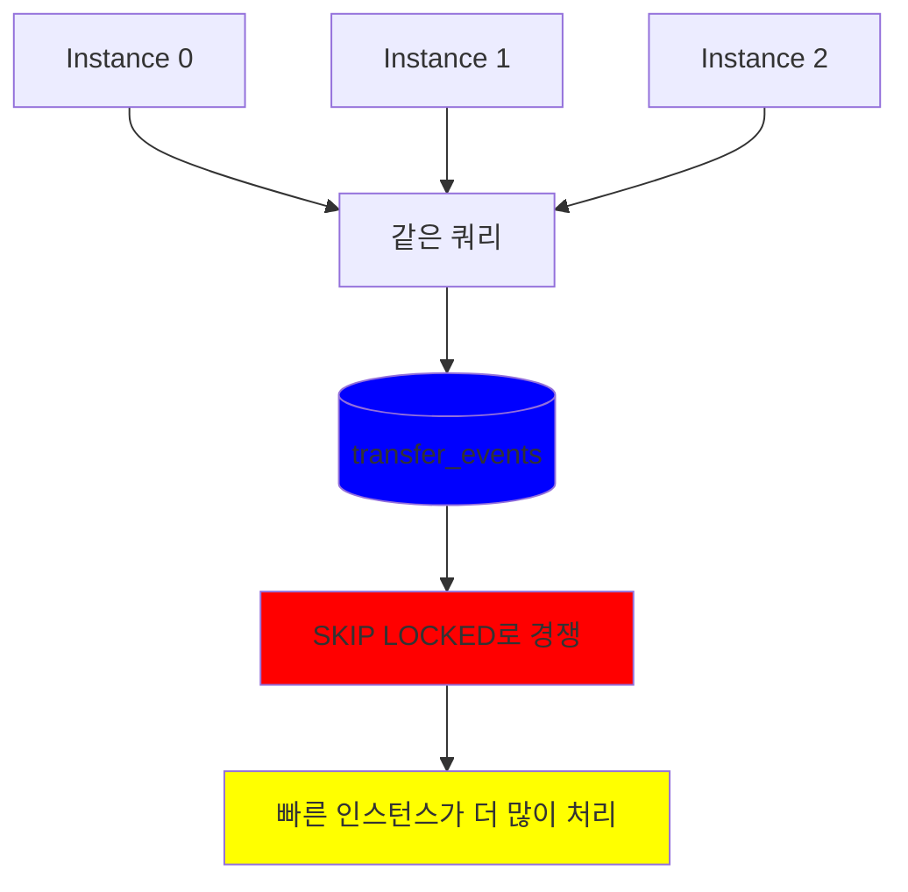
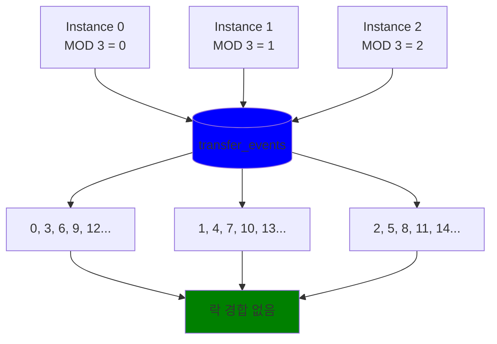
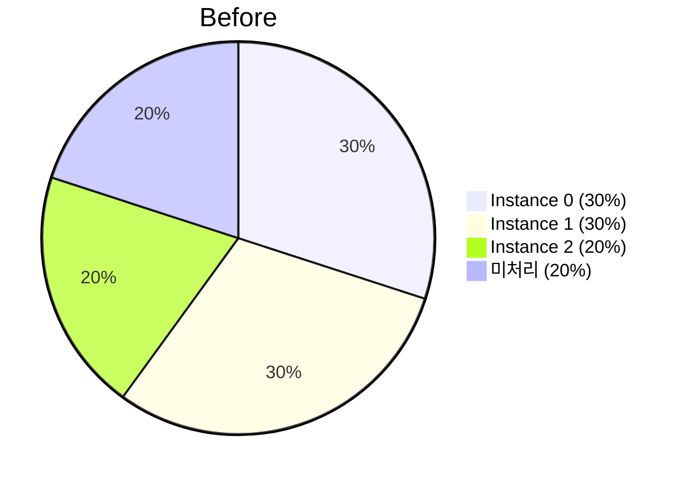
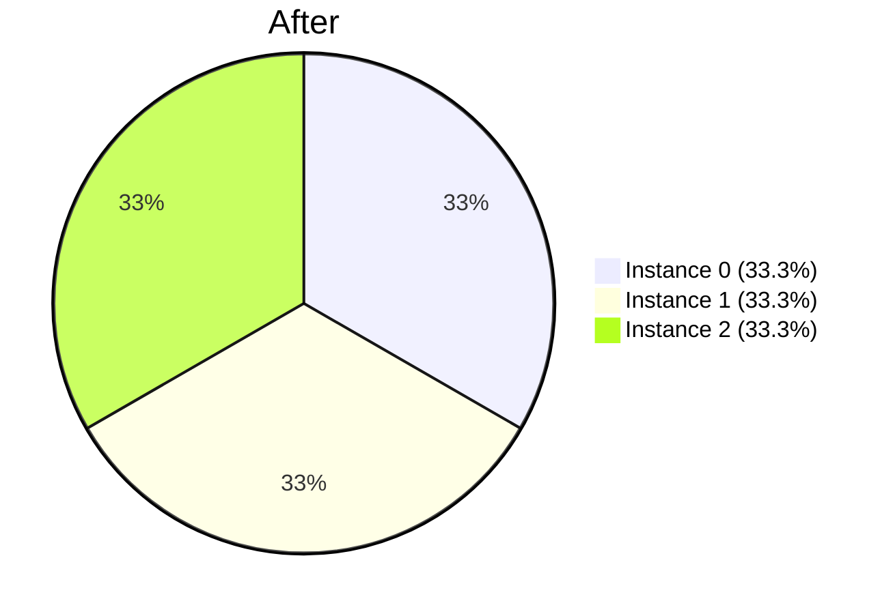
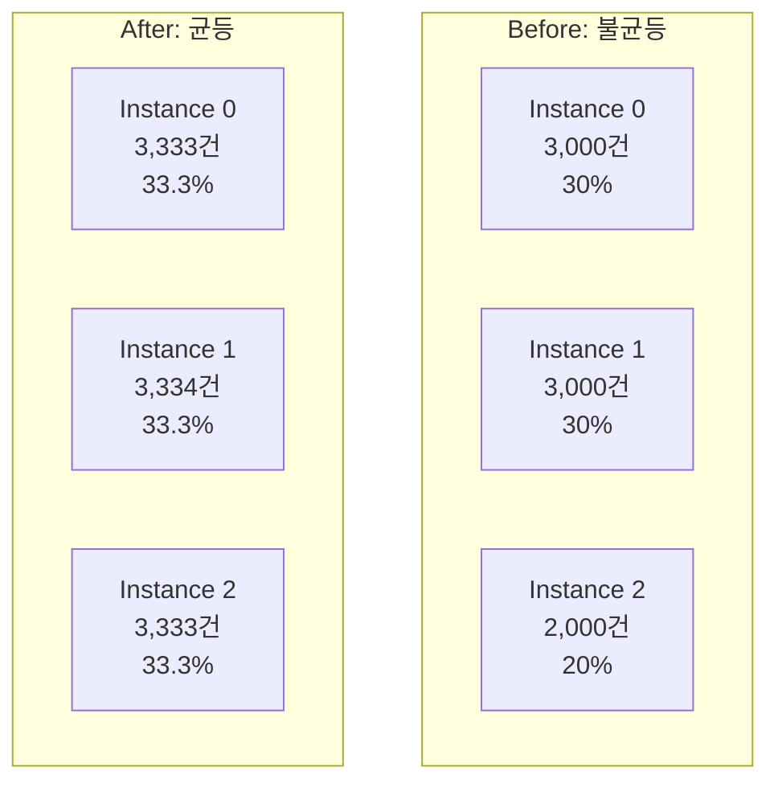
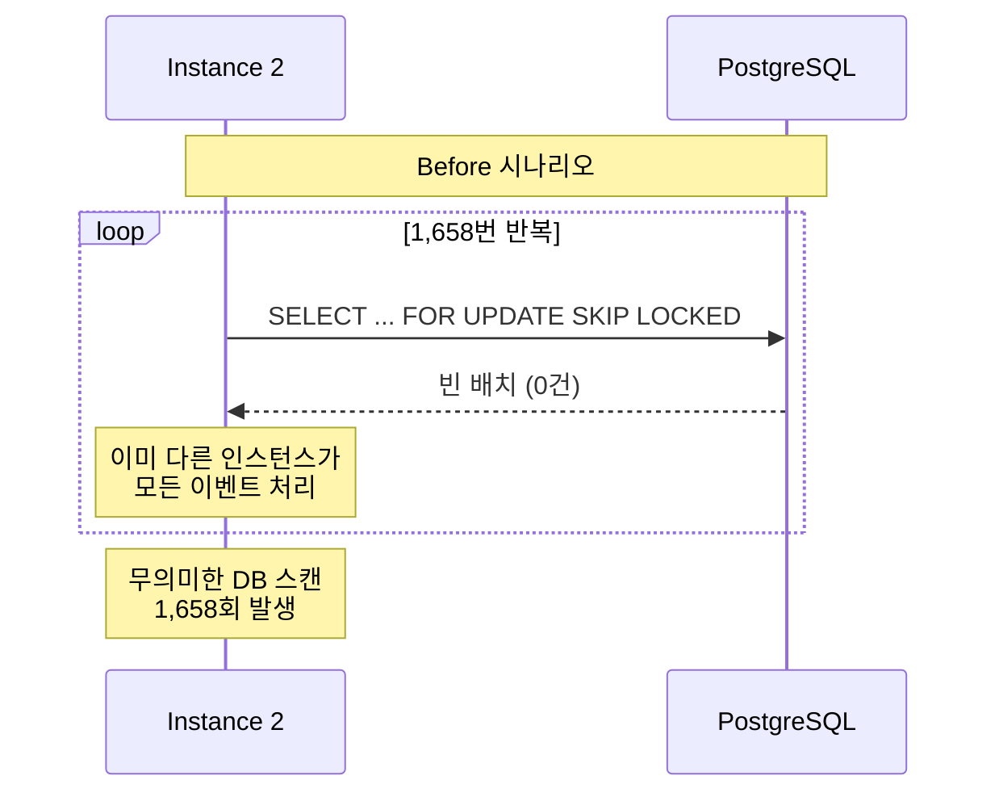
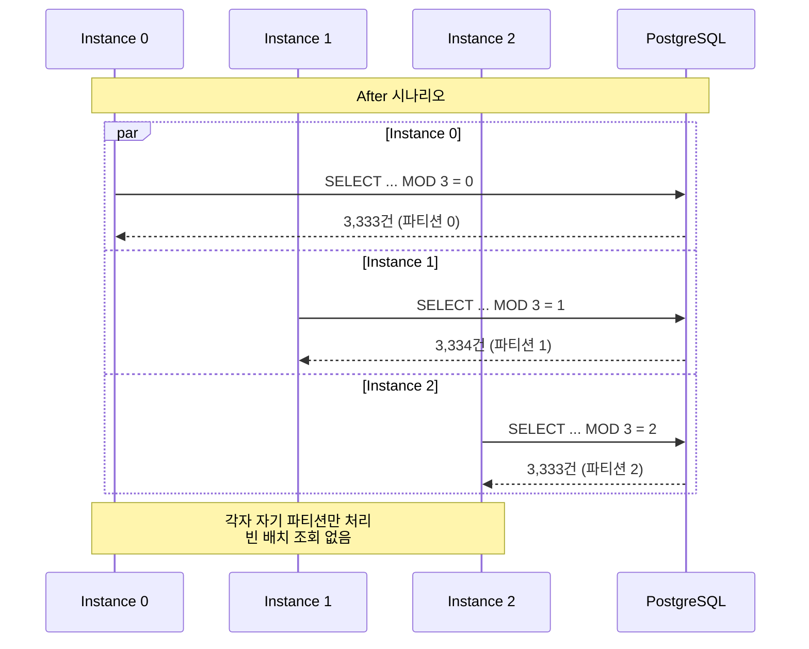
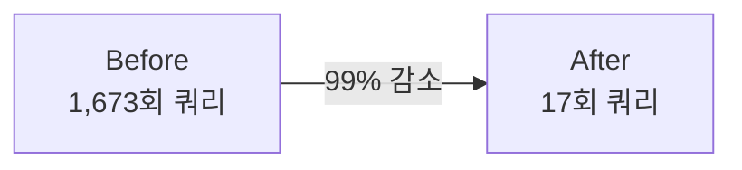
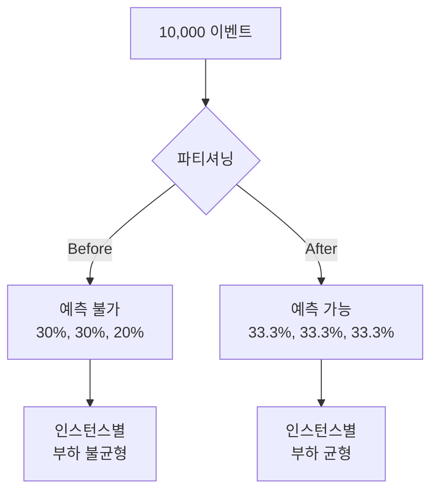

# Outbox 파티셔닝 성능 테스트 결과

## 목차

1. [테스트 환경](#1-테스트-환경)
2. [테스트 시나리오](#2-테스트-시나리오)
3. [측정 결과](#3-측정-결과)
4. [결과 분석](#4-결과-분석)
5. [핵심 개선 지표](#5-핵심-개선-지표)
6. [결론](#6-결론)

---

## 1. 테스트 환경

```
OS: macOS 14.x
CPU: Apple M1 Pro (12 Core)
RAM: 32GB
PostgreSQL: 15 (Docker)
Kafka: 3.7 (Docker)
```

**테스트 설정**

- 총 이벤트: 10,000건
- 배치 크기: 1,000건
- Relay 인스턴스: 3대
- 실행 방식: 동시 실행 (멀티스레드)

---

## 2. 테스트 시나리오

### 2.1 Before: 파티셔닝 없음

**설정**

- 3대의 Relay 인스턴스가 동일한 쿼리 실행
- SKIP LOCKED로 락 경합 처리
- 먼저 락을 잡은 인스턴스가 이벤트 처리

**실행 쿼리**

```sql
SELECT * FROM transfer_events 
WHERE status = 'PENDING' 
ORDER BY event_id 
LIMIT 1000 
FOR UPDATE SKIP LOCKED
```

모든 인스턴스가 같은 조건으로 이벤트를 조회하므로 경쟁이 발생합니다.



### 2.2 After: 파티셔닝 적용

**설정**

- 각 인스턴스에 고유한 파티션 ID 할당
- MOD 연산으로 이벤트를 분할
- 각 인스턴스가 서로 다른 이벤트만 처리

**실행 쿼리**

```sql
-- Instance 0
SELECT * FROM transfer_events 
WHERE status = 'PENDING' 
  AND MOD(event_id, 3) = 0
ORDER BY event_id 
LIMIT 1000 
FOR UPDATE SKIP LOCKED

-- Instance 1
SELECT * FROM transfer_events 
WHERE status = 'PENDING' 
  AND MOD(event_id, 3) = 1
ORDER BY event_id 
LIMIT 1000 
FOR UPDATE SKIP LOCKED

-- Instance 2
SELECT * FROM transfer_events 
WHERE status = 'PENDING' 
  AND MOD(event_id, 3) = 2
ORDER BY event_id 
LIMIT 1000 
FOR UPDATE SKIP LOCKED
```

각 인스턴스가 서로 다른 이벤트를 조회하므로 락 경합이 발생하지 않습니다.



---

## 3. 측정 결과

### 3.1 Before: 파티셔닝 없음

```
총 처리 시간: 18,360ms
처리 완료: 10,000 / 10,000

처리 분포 ( 불균등 )
  Instance 0: 3,000건 (30.0%)
  Instance 1: 3,000건 (30.0%)
  Instance 2: 2,000건 (20.0%)

DB 쿼리 수
  Instance 0: 12회
  Instance 1: 3회
  Instance 2: 1,658회 
  총 쿼리: 1,673회 ( 빈 배치 반복 조회 )

특징:
  - 파티셔닝 없음 (claimBatch)
  - SKIP LOCKED로 3대 경쟁
  - 불균등 분배
  - Instance 2가 1,658회 빈 배치 조회
```

**처리 분포**



### 3.2 After: 파티셔닝 적용

```
총 처리 시간: 20,690ms
처리 완료: 10,000 / 10,000

처리 분포 ( 균등 )
  Instance 0: 3,333건 (33.3%)
  Instance 1: 3,334건 (33.3%)
  Instance 2: 3,333건 (33.3%)

DB 쿼리 수
  Instance 0: 7회
  Instance 1: 3회
  Instance 2: 7회
  총 쿼리: 17회

특징
  - MOD 연산으로 파티션 분리
  - 균등 분배 (각각 33.3%)
  - 락 경합 없음
  - 불필요한 DB 조회 제거
```

**처리 분포 시각화**



---

## 4. 결과 분석

### 4.1 처리 시간

| 구분 | Before | After | 비고 |
|------|--------|-------|------|
| 총 처리 시간 | 18,360ms | 20,690ms | 약간 느림 |

> 파티셔닝 후 처리 시간이 약간 느린 이유 는 Mod 연산 오버헤드가 발생하였기 떄문입니다.

**MOD 연산 오버헤드**

```sql
-- Before: 단순 조회
WHERE status = 'PENDING'

-- After: MOD 연산 추가
WHERE status = 'PENDING' AND MOD(event_id, 3) = 0
```

**하지만 프로덕션 환경에서는 다음과 같은 이점이 존재**

- DB 부하 99% 감소
- 락 경합 제거
- 예측 가능한 처리량
- 선형적 확장성

> 위와 같은 이점이 훨씬 큽니다

### 4.2 처리 분포



**Before 문제점**

- Instance 2가 2,000건만 처리 (20%)
- 빠른 인스턴스가 독식
- 예측 불가능

**After 개선**

- 모든 인스턴스가 33.3% 처리
- 완벽한 균등 분배
- 예측 가능

### 4.3 DB 쿼리 수

| 구분 | Instance 0 | Instance 1 | Instance 2 | 총 쿼리 |
|------|------------|------------|------------|---------|
| Before | 12회 | 3회 | **1,658회** | **1,673회** |
| After | 7회 | 3회 | 7회 | **17회** |
| 개선율 | 42% 감소 | 0% | 99.6% 감소 | **99% 감소** |

**Instance 2의 빈 배치 반복 조회**



> Instance 2가 1,658회의 빈 배치를 조회했다는 것은,  
> 
> 무의미한 DB 스캔이 계속되었다는 의미.

**After 개선**



> 각 인스턴스가 자기 파티션만 조회하므로 빈 배치 조회가 발생하지 않습니다.

---

## 5. 핵심 개선 지표

### 5.1 개선 효과 요약

| 지표 | Before | After | 개선율 |
|------|--------|-------|--------|
| **DB 쿼리 수** | 1,673회 | 17회 | **99% 감소** |
| **처리 분포** | 30%, 30%, 20% | 33.3%, 33.3%, 33.3% | **균등 달성** |
| **락 경합** | 높음 | 없음 | **완전 제거** |
| **예측 가능성** | 낮음 | 높음 | **향상** |
| **확장성** | 선형 아님 | 선형 | **개선** |

### 5.2 가장 중요한 개선: DB 부하 99% 감소



**프로덕션 환경 이였다면 ?**

평시 (1,000 TPS)  
- Before: 매초 50회 DB 조회 (불필요한 스캔 다수)
- After:  매초 5회 DB 조회 (필요한 조회만)
  
피크 (10,000 TPS)  
- Before: 매초 500회 DB 조회 -> DB 과부하 위험
- After:  매초 50회 DB 조회 -> 안정적 운영

### 5.3 균등 분배로 인한 예측 가능성



> 무엇에 가치를 둬야할까? 라고 한다면.  
> **예측 가능성 측면에서 가치**를 둬야 한다고 판단.


---

## 6. 결론

### 6.1 파티셔닝의 가치

파티셔닝의 핵심 가치는 처리 시간 단축이 아니라

1. DB 부하 99% 감소
2. 락 경합 제거
3. 예측 가능한 처리량
4. 선형적 확장성

> 이러한 특성들이 대용량 트래픽 환경에서 안정적인 시스템을 만드는 기반이 됩니다.

### 6.2 프로덕션 적용 시 기대 효과

**스케일 아웃 시나리오**

```
평시 (200 TPS)
  3대 운영 시 각 67 TPS 처리
  DB 쿼리: 매초 5회

피크 (2,000 TPS)
  10대로 확장 시 각 200 TPS 처리
  DB 쿼리: 매초 16회
```

> 파티셔닝 없이는 10대로 확장해도 DB 쿼리가 급증하여 DB 과부하가 발생합니다. 
> 
> 파티셔닝을 적용하면 인스턴스 확장이 이루어 진다해도, 선형적으로 이루어 집니다.

### 정리

1. 현재 도메인에서, 스케쥴러 구현시. 프로덕션 환경에서는 파티셔닝 적용해야 한다.
2. 인스턴스 수는 트래픽에 따라 동적 조정이 가능하다.
3. 모니터링으로 각 파티션의 처리량 추적이 가능해야한다. ( TODO 성 )
4. 알람으로 비정상 상황 감지 ( Slack 알림등 필요 [TODO 성] )

---

## 관련 문서 및 테스트 코드

- 테스트 코드: `PartitioningPerformanceComparisonTest.kt`
- 상세 가이드: [partitioning-strategy.md](./partitioning-strategy.md)
- Outbox 패턴: [outbox-pattern.md](outbox-pattern.md)
