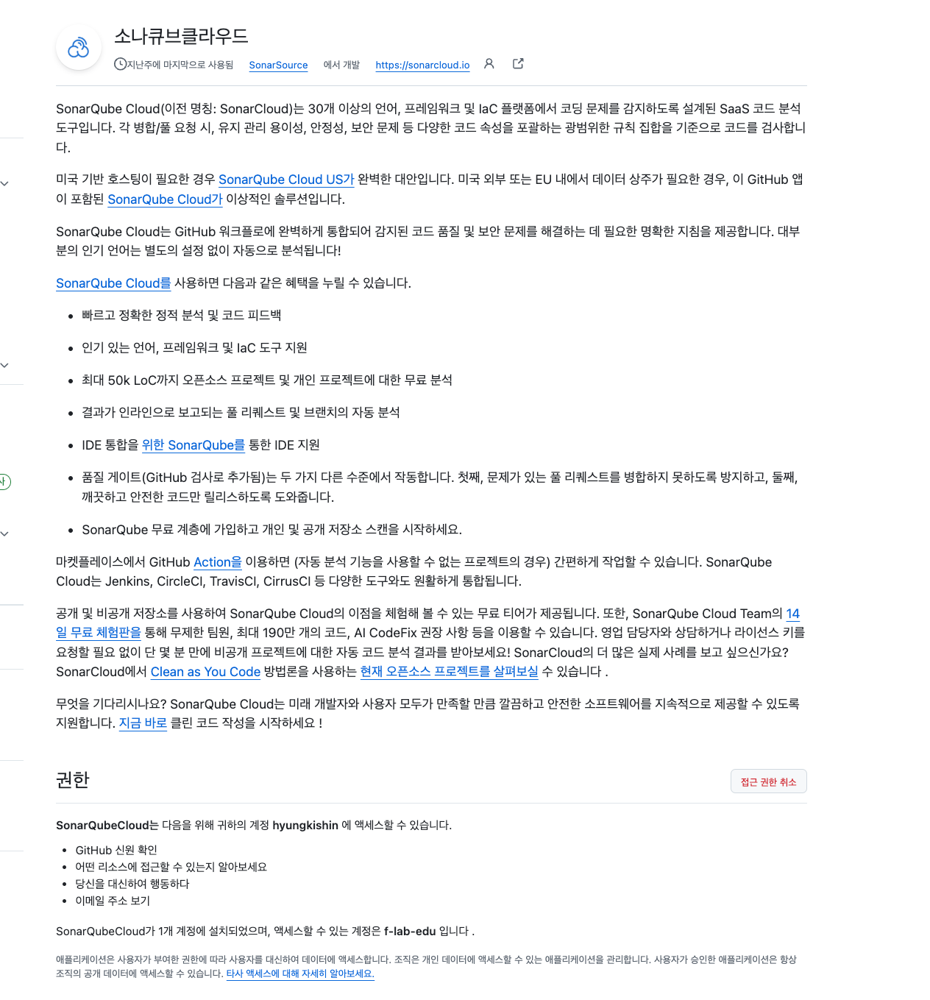

## sornar Qube 연동

코드 커버리지를 측정하는 Jacoco와는 달리 SonarQube 는 코드의 질을 측정하는 도구이다.
"얼마나 테스트했는가" 에 가까운 것은 Jacoco, "코드가 건강한가?" 를 측정하는 쪽은 SonarQube 라고 보면 된다.

## 어떤 걸 분석하나 ?
SonarQube 는 코드를 Scan 해서 다음과 같은 부분을 자동으로 체크해준다.  

- Bug: 확정은 아니지만 왠지 오류 날 것 같은 코드
- Code Smell: 미래 퇴사 플래그 같은 구조적 문제 경고
- Security Hotspot: 보안 취약 가능성 있는 위치
- Duplications: 중복 코드
- Coverage: 테스트 커버리지 (Jacoco 연동 시 자동 포함)

## 오 과연...사람 냄새 나는 리뷰와 어떤 차이가 있을까?
사람 리뷰는 주관적이고, 경험에 따라 다를 수 있고, “이해”하는 데에 강하다.   
SonarQube 는 코드에서 “패턴”을 읽는 데에 강하다고 한다.  

> 올 ... point 가 명확했다.  
> 코드 줄 수가 많아질수록, 리뷰가 귀찮아질수록, 오히려 정적 분석기가 더 *열일한다* 고 할 수 있겠다.

Jacoco 의 커버리지 는 테스트의 양을 보여주고,   
SonarQube 는 코드의 질을 보여준다.