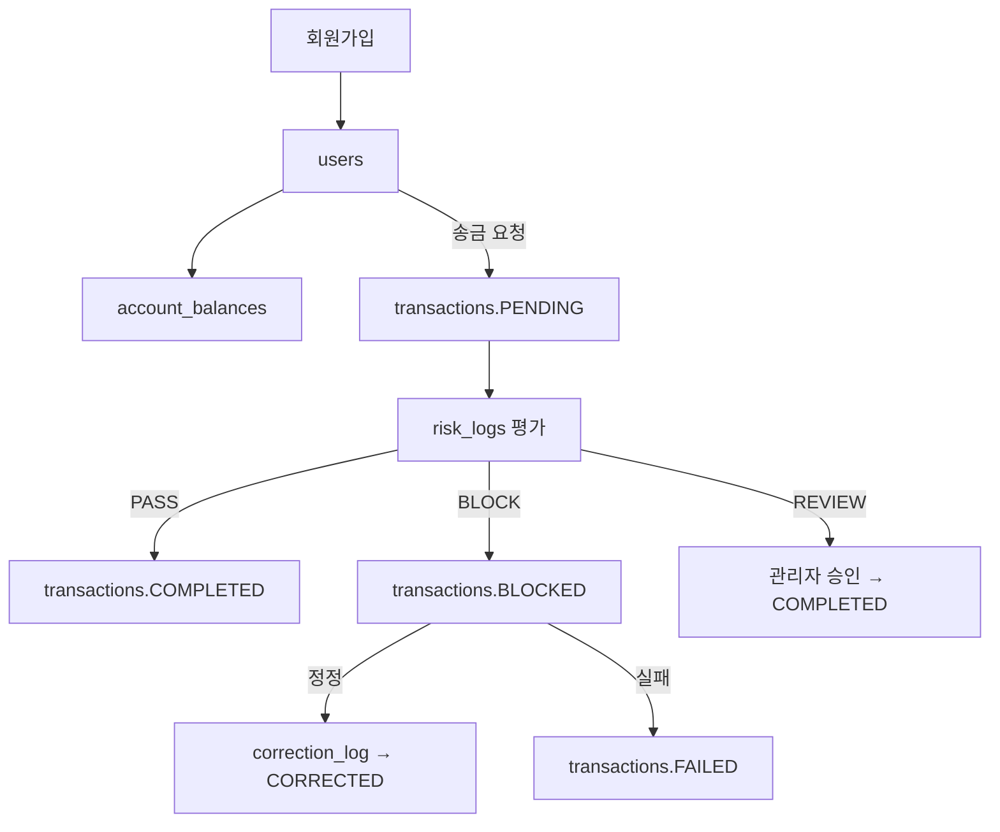
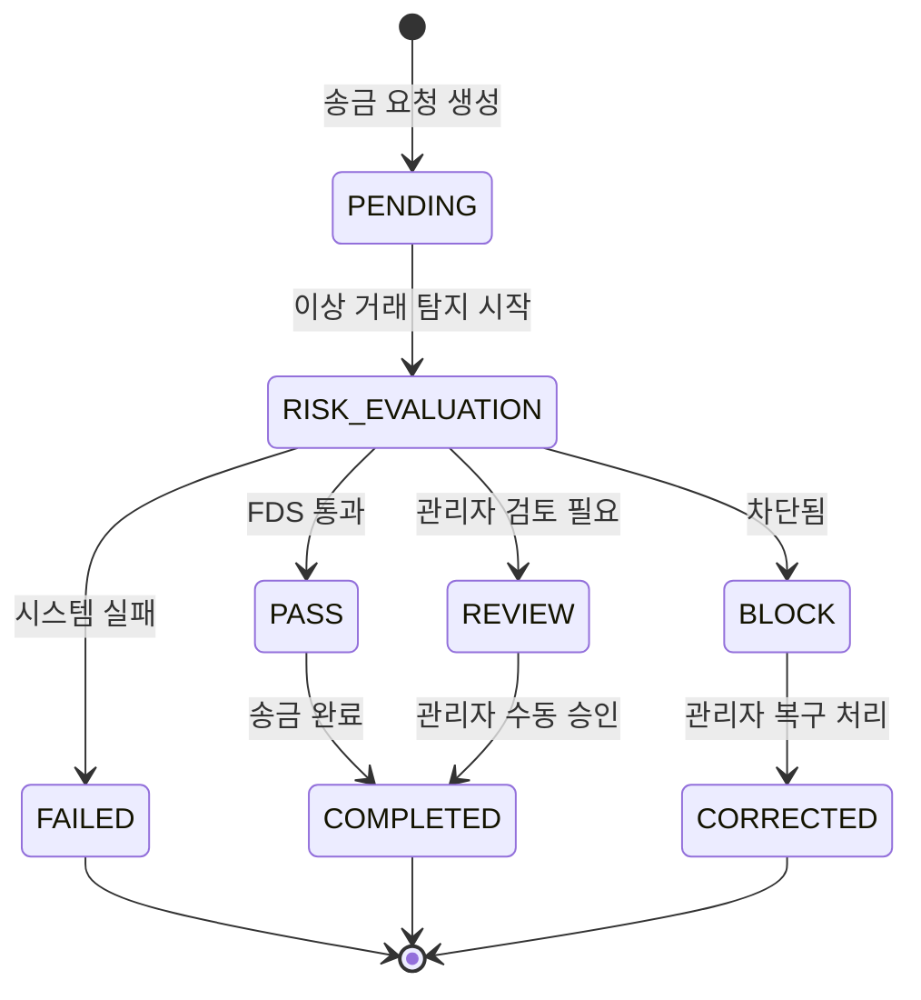

# 전체 송금 흐름 개요

---

---

## Step 1: 회원가입

- **이벤트**: 신규 사용자가 회원가입
- **상태 없음** (초기 데이터 등록)
- **적재 테이블**:
    - `users`: ID, 이메일, 이름
    - `account_balances`: 잔액 0으로 초기화
- **관계**:
    - `users.id` = `account_balances.user_id`

---

## Step 2: 송금 요청 발생

- **이벤트**: A → B에게 송금 요청
- **상태 전이**: `null → PENDING`
- **적재 테이블**: `transactions`
- **주요 필드**: `sender_user_id`, `receiver_user_id`, `amount`, `status = PENDING`

---

## Step 3: 이상 거래 탐지 (FDS 평가)

- **이벤트**: 송금 요청에 대한 FDS 룰 기반 평가
- **상태 전이**: `PENDING → RISK_EVALUATION`
- **적재 테이블**:
    - `risk_logs`: `ai_score`, `rule_hit`, `final_decision`
    - `risk_rule_hits`: `rule_id`, `score`, `hit`

---

## Step 4-1: 평가 통과 (PASS)

- **상태 전이**: `RISK_EVALUATION → PASS → COMPLETED`
- **적재 테이블**:
    - `tx_history`: 상태 이력

---

## Step 4-2: 평가 차단 (BLOCK)

- **상태 전이**: `RISK_EVALUATION → BLOCK`
- **후속 흐름**:
    - 수동 정정 시: `BLOCK → CORRECTED` (`correction_log`)
    - 복구 실패 시: `BLOCK → FAILED` (`dlq_events` 또는 수동 종료)

---

## Step 4-3: 관리자 검토 (REVIEW)

- **상태 전이**: `RISK_EVALUATION → REVIEW → COMPLETED`
- **조건**: 룰은 hit 되었으나 애매하거나 정책상 수동 판단 필요

---

# Domain 설명

## User Domain

| 테이블 | 설명 |
|--------|------|
| `users` | 사용자 정보 (이메일 unique) |
| `account_balances` | 현재 자산 잔액 상태 |

## Transaction Domain

| 테이블 | 설명 |
|--------|------|
| `transactions` | 송금 요청, 상태 포함 |
| `tx_history` | 상태 변경 이력 |
| `correction_log` | 정정 기록 |

## Risk Detection Domain

| 테이블 | 설명 |
|--------|------|
| `risk_logs` | AI/FDS 평가 결과 |
| `risk_rule_hits` | 룰별 평가 결과 |
| `rules` | 룰 정의 |
| `rule_history` | 룰 변경 이력 |

## Admin Domain

| 테이블 | 설명 |
|--------|------|
| `admin_users` | 관리자/감사 계정 |

## Infra Domain

| 테이블 | 설명 |
|--------|------|
| `dlq_events` | Kafka 등 비동기 실패 로그 |

---

# 상태 정의

| 상태                | 설명                              |
| ----------------- | ------------------------------- |
| `PENDING`         | 송금 요청이 생성되었고 아직 평가되지 않음         |
| `RISK_EVALUATION` | 이상 거래 탐지(FDS) 중이며 평가 결과를 기다리는 중 |
| `PASS`            | FDS 평가 통과 → 송금 가능               |
| `REVIEW`          | 관리자 수동 판단이 필요한 상태               |
| `BLOCK`           | FDS 평가 차단됨 (AI 또는 룰)            |
| `COMPLETED`       | 송금 완료됨                          |
| `CORRECTED`       | 차단 또는 실패 후 금액이 수동으로 조정되어 완료된 상태 |
| `FAILED`          | 시스템 오류, 잔액 부족 등으로 실패됨           |

## 상태별 로그 흐름

| 이벤트                 | 상태 전이                         | 관련 로그                                       |
| ------------------- | ----------------------------- | ------------------------------------------- |
| 사용자 A가 송금 요청        | `null` → `PENDING`            | `transactions`                              |
| FDS 평가 시작           | `PENDING` → `RISK_EVALUATION` | `tx_history`                                |
| 룰 hit & AI score 높음 | `RISK_EVALUATION` → `BLOCK`   | `risk_logs`, `risk_rule_hits`, `tx_history` |
| 관리자 수동 복구           | `BLOCK` → `CORRECTED`         | `correction_log`, `tx_history`              |
| 송금 정상 완료            | `PASS` → `COMPLETED`          | `tx_history`                                |

---

# 상태 흐름 다이어그램

