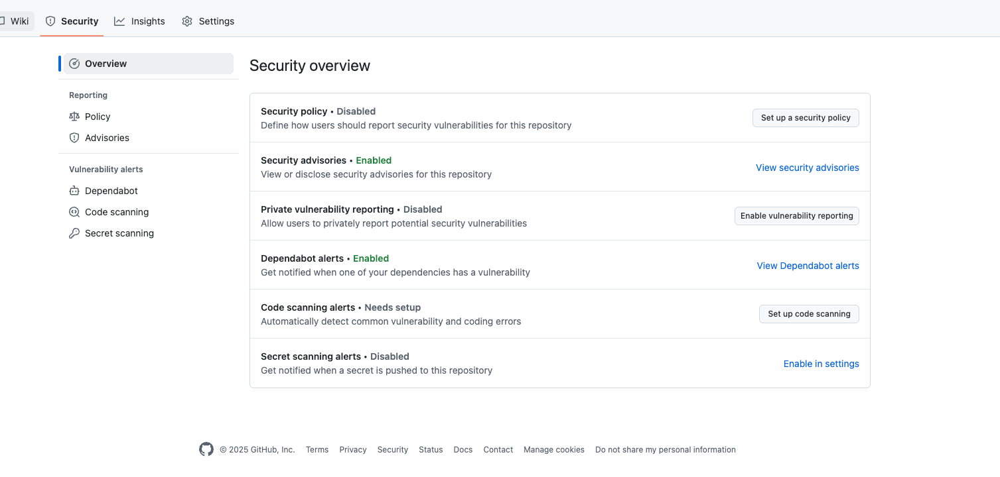
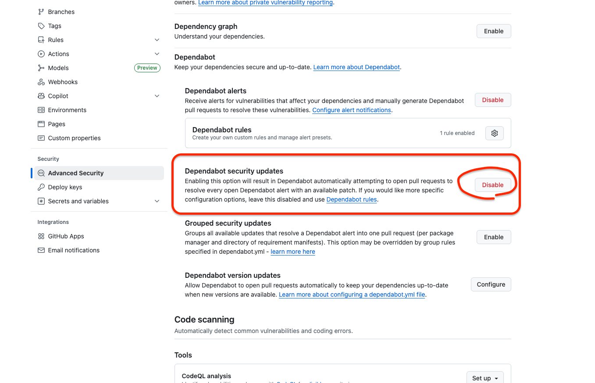

# 라이브러리 취약점 점검

외부 라이브러리는 우리가 만든 코드가 아니다.  

오픈소스는 공개되어 있고, 해커도 코드를 본다.

한 번 취약점(CVE)이 발견되면 전 세계적으로 뚫리게 되고, 만약 회사에서 쓰는 버전이 구버전이라면 서비스가 뚫리게 될 것이다.

실제 보안 사고의 대부분은 서드파티 라이브러리에서 발생한다고 한다.

## 로그 찍다 서버 털려 나락행 - Log4j (CVE-2021-44228) 사태

2021년 11월에 Log4 Shell이라고도 알려진 Log4j 취약점이 이슈였다.

Apache Log4j 로깅 라이브러리에서 발견된 매우 심각한 취약점 인데,  

해커에게 패치되지 않은 버전의 Log4j를 실행하는 디바이스를 완전히 제어할 수 있는 권한을 부여했다.

이 취약점은 원격 코드 실행(RCE) 취약점으로, 해커가 이 취약점을 이용해 서버에 악성 코드를 실행할 수 있었다. ( 대-박 ;;)

이로 인해 전 세계적으로 수많은 서비스가 영향을 받았고, 많은 기업들이 긴급하게 패치를 적용해야 했다.

피해를 입은 기업들 내에 개발자들 진짜 위로 마려웠다. 

우리가 잘 아는 머기업 중 Minecraft, Twitter, Cisco, AWS, 거의 전세계 웹서비스 광역 으로 영향을 받았다는 사실.

- 2021년 12월엔 분당 100건 이상 공격
- 봇넷, 크립토마이너, 랜섬웨어, 국가단위 해커까지 총 집합
- 미 국토안보부: “이거 고치는 데 10년 걸릴 수도”

오픈소스 라이브러리의 취약점이 얼마나 심각한 영향을 미칠 수 있는지를 잘 보여주는 사례임을 알 수 있다.

> 사실상 이런 설정을 해보는 것은 사이드 프로젝트가 아니고서야 ... 해볼일이 없을것 같긴 하다.
> 
> 나의 최애 true 멘토님 께서 이런 부분을 말씀 주셨고,   
> 사이드 프로젝트에 적용을 위해 검색을 하다 보니 2가지 방식이 존재한다. 

## 목적
- 외부 오픈소스 라이브러리 취약점(CVE) 사전 탐지
- 보안 이슈 자동 감지 및 대응 자동화 ( Dependabot )
- 보안 안정성 확보

> 가보자고.
---

## 적용 방식
적용 하는 방식은 크게 2가지가 있다.

1. GitHub Actions 기반의 Dependabot
2. 로컬/CI 기반의 OWASP Dependency Check

### 첫번째 방식 :`.github/dependabot.yml` 추가

```yaml
version: 2
updates:
  - package-ecosystem: "gradle"
    directory: "/"  # 루트 gradle 기준
    schedule:
      interval: "daily"
```

### GitHub Security 설정 확인
> 리포지토리 → Settings > Security 항목에서 아래 2개 설정이 Enabled 되어 있어야 한다.
> - Security advisories
> - Dependabot alerts



>? 응 ?? 하나밖에 안켜져있ㄷ군요...
> Advanced Security 에서 켜주면 될것 같다.



### pr 확인

> 오... 재밌어. 짜릿해. 개멋져.


### 두번째 방식 : 로컬/CI 기반의 OWASP Dependency Check
- Gradle 플러그인 설치 후, 직접 ./gradlew dependencyCheckAnalyze 실행
- 로컬에서 빠르게 점검 가능하고, CI에 붙이기도 쉽다.

```kotlin
// build.gradle.kts
plugins {
    ...다른 설정들 있다고 가정하고...
    id("org.owasp.dependencycheck") version "8.4.0" // 🤏 살포시 추가 
}

... 그외 설정 생략하고 ...

dependencyCheck {
    failBuildOnCVSS = 7.0.toBigDecimal() // 취약점 기준점
    suppressionFile = "dependency-check-suppress.xml"
    analyzers {
        assemblyEnabled = false
    }
}
```

### HTML + XML 리포트 생성 확인

`./gradlew dependencyCheckAnalyze` 실행

> 실행 후, build 결과에 리포트가 생성되니 확인해보자.
```text
build/reports/dependency-check-report.html
build/reports/dependency-check-report.xml
```
엥 이게 끝...? 두번째 방식 역시 너무 간단해서 놀랐고... 대규모 인프라에서는 어떻게 적용할지 궁금했다. 

### Cloude 기반 대규모 인프라에서 고려할 점

이럴땐 GPT 활용을 해줘야 한다. ( 물론 모든 상황에서, 만능은 아니지만... )

| 항목                       | 이유 / 설명                                                             |
|--------------------------| ------------------------------------------------------------------- |
| **정적 보고서만으로 부족**         | 팀 단위, 멀티 서비스 상황에선 결과를 공유하고 집계할 중앙화된 리포팅 필요                          |
| **스캔 속도 / DB 캐시 최적화 필요** | 네트워크가 느리거나 스캔이 많아질 경우, NVD DB 캐시를 CI에서 관리해야 할 수도 있음                 |
| **false positive 억제**    | suppression 파일(`dependency-check-suppress.xml`)을 점점 정교하게 커스터마이징해야 함 |
| **보안 정책 연동**             | 취약점이 발견됐을 때 Slack 알림, JIRA 생성, S3에 업로드 등 자동화 필요 가능성                 |
| **멀티모듈 / 멀티서비스 지원**      | 모노레포 / 마이크로서비스 구조일 경우, 각 모듈별 리포트 통합 필요                              |

> 나중에 확인 ㄱㄱ 일단은 현재 진행중인 프로젝트는 github actions 기반이라 1번을 채택하기로 하였다.

---

## 참고 자료
- [OWASP Dependency-Check Gradle Plugin](https://owasp.org/www-project-dependency-check)
- [Keeping your dependencies updated automatically with Dependabot version updates](https://docs.github.com/en/code-security/dependabot/dependabot-version-updates)